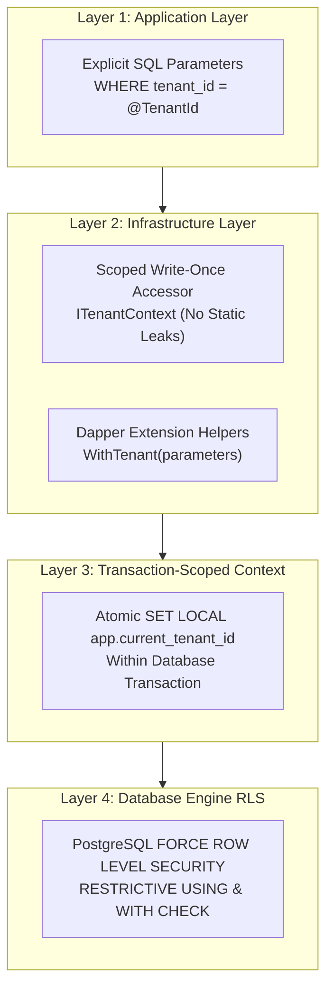
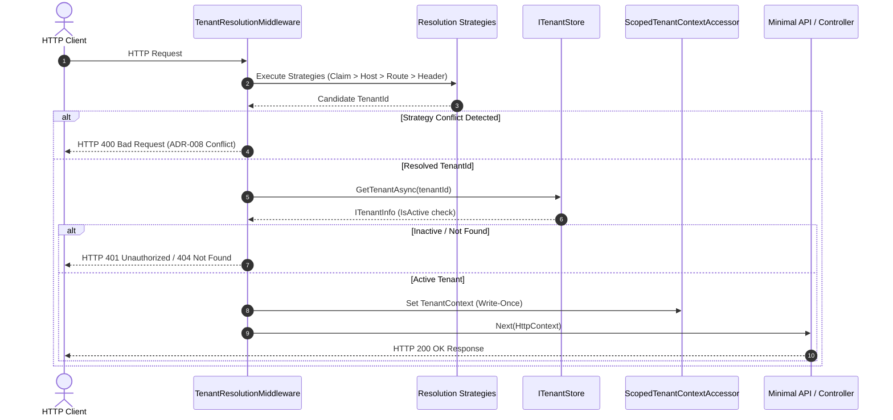

# EricksonLopez.MultiTenancy

Secure, high-performance, Native AOT-compatible, enterprise-grade multi-tenancy ecosystem and 4-layer Defense-in-Depth isolation for modern .NET.

[](https://github.com/ericksonlopezf/dotnet-multitenancy/actions)
[](https://codecov.io/gh/ericksonlopezf/dotnet-multitenancy)
[](https://sonarcloud.io/summary/new_code?id=ericksonlopezf_dotnet-multitenancy)
[](https://github.com/ericksonlopezf/dotnet-multitenancy/blob/main/docs/testing-strategy.md)
[](https://www.nuget.org/packages/EricksonLopez.MultiTenancy)
[](https://www.nuget.org/packages/EricksonLopez.MultiTenancy)
[](https://github.com/ericksonlopezf/dotnet-multitenancy/blob/main/LICENSE)
[](https://dotnet.microsoft.com)
[](https://learn.microsoft.com/en-us/dotnet/core/deploying/native-aot)

---

## Executive Summary

`EricksonLopez.MultiTenancy` is a foundational, Native AOT-first multi-tenancy ecosystem engineered for **.NET 8.0, .NET 9.0, and .NET 10.0** applications built with **Clean Architecture**, **Domain-Driven Design (DDD)**, and relational persistence engines (**PostgreSQL**, **SQL Server**, **MySQL**, **MariaDB**, **Oracle**, and **SQLite**). 

The architecture is founded upon an absolute, non-negotiable security invariant:

> **A single defective layer must not be able to destroy tenant isolation (Defense-in-Depth).**

By coupling explicit application parameterization, scoped write-once accessors, and transaction-scoped database session contexts (`SET LOCAL` for PostgreSQL Row Level Security, `sp_set_session_context` for SQL Server), the ecosystem eliminates ambient state leakage across recycled connection pools, rejects brittle dynamic SQL string rewriting, enforces compile-time Roslyn diagnostic rules, and guarantees zero heap allocations on identifier comparisons and resolution hot paths.

---

## Table of Contents

- [🎯 What Problem It Solves](#-what-problem-it-solves)
  - [Traditional Multi-Tenancy Anti-Patterns](#traditional-multi-tenancy-anti-patterns)
  - [How EricksonLopez.MultiTenancy Solves This](#how-ericksonlopezmultitenancy-solves-this)
- [⚡ Key Features](#-key-features)
- [📦 Ecosystem](#-ecosystem)
- [📚 Documentation](#-documentation)
  - [🎓 Step-by-Step Interactive Showcase (Levels 00 to 10)](#-step-by-step-interactive-showcase-levels-00-to-10)
  - [📖 Technical Reference & Architecture Guides](#-technical-reference--architecture-guides)
- [📥 Installation](#-installation)
  - [Core Engine & Abstractions](#core-engine--abstractions)
  - [Web & ASP.NET Core Hosting](#web--aspnet-core-hosting)
  - [Relational Database Dialects](#relational-database-dialects)
  - [Observability & Testing](#observability--testing)
- [🚀 Quick Start](#-quick-start)
  - [1. Strongly-Typed Tenant Identity](#1-strongly-typed-tenant-identity)
  - [2. Dependency Injection & Pipeline Configuration](#2-dependency-injection--pipeline-configuration)
  - [3. Explicit SQL Queries with Dapper (Layer 1)](#3-explicit-sql-queries-with-dapper-layer-1)
  - [4. PostgreSQL Row Level Security Enforcement (Layers 3 & 4)](#4-postgresql-row-level-security-enforcement-layers-3--4)
  - [5. Isolated Background Processing](#5-isolated-background-processing)
- [💡 Core Use Cases](#-core-use-cases)
  - [1. Clean Architecture & CQRS Query Handlers](#1-clean-architecture--cqrs-query-handlers)
  - [2. Multi-Strategy Resolution with Fail-Closed Conflict Detection](#2-multi-strategy-resolution-with-fail-closed-conflict-detection)
  - [3. Per-Tenant Configuration & Feature Options](#3-per-tenant-configuration--feature-options)
  - [4. Background Job & Message Queue Consumers](#4-background-job--message-queue-consumers)
  - [5. Per-Tenant Authentication Schemes & Dynamic Cookies](#5-per-tenant-authentication-schemes--dynamic-cookies)
  - [6. Database-per-Tenant Dynamic Connection Routing](#6-database-per-tenant-dynamic-connection-routing)
- [🔌 Configuration & Integrations](#-configuration--integrations)
  - [ASP.NET Core & Minimal APIs](#aspnet-core--minimal-apis)
  - [OpenTelemetry Tracing & Metrics](#opentelemetry-tracing--metrics)
  - [Multi-Tenancy Health Checks](#multi-tenancy-health-checks)
  - [Caching & Tenant Store Strategies](#caching--tenant-store-strategies)
  - [Roslyn Diagnostic Analyzers Reference](#roslyn-diagnostic-analyzers-reference)
- [🧪 Testing & Quality](#-testing--quality)
  - [Testing Primitives & Doubles](#testing-primitives--doubles)
  - [Unit & Integration Test Example](#unit--integration-test-example)
  - [Architectural Boundary Verification](#architectural-boundary-verification)
  - [Quality Gate & Mutation Testing Metrics](#quality-gate--mutation-testing-metrics)
- [⚡ Performance Benchmarks](#-performance-benchmarks)
- [🌐 Compatibility & Technical Matrix](#-compatibility--technical-matrix)
  - [Framework & Compilation Target Matrix](#framework--compilation-target-matrix)
  - [Relational Database Dialect Isolation Matrix](#relational-database-dialect-isolation-matrix)
  - [HTTP Status Code & Security Error Mapping](#http-status-code--security-error-mapping)
- [🏛️ Architecture & Design Principles](#-architecture--design-principles)
  - [4-Layer Defense-in-Depth Model](#4-layer-defense-in-depth-model)
  - [Request Resolution Lifecycle Sequence](#request-resolution-lifecycle-sequence)
  - [Tenant Context Lifecycle State Machine](#tenant-context-lifecycle-state-machine)
  - [Package Layering & Dependency Hierarchy](#package-layering--dependency-hierarchy)
- [🛡️ Best Practices & Anti-Patterns](#-best-practices--anti-patterns)
- [⚠️ Troubleshooting & Common Pitfalls](#-troubleshooting--common-pitfalls)
- [🌐 Part of the Ecosystem](#-part-of-the-ecosystem)
- [🤝 Contributing](#-contributing)
- [📄 License](#-license)

---

## 🎯 What Problem It Solves

### Traditional Multi-Tenancy Anti-Patterns

1. **The Fragile Illusion of Application-Only Filtering:**
   Legacy libraries rely exclusively on runtime AST/regex SQL string rewriting or Entity Framework Core Global Query Filters (`HasQueryFilter`). If an engineer executes a raw Dapper query, uses a subquery, joins an un-mapped view, or invokes a native stored procedure, the filter is omitted and tenant isolation collapses silently.
2. **Connection Pool Contamination & Session Bleeding:**
   Setting session-level database state (`SET app.current_tenant = 'tenant-a'`) binds state to the physical connection. When ADO.NET returns the connection to the connection pool, subsequent requests for Tenant B reusing that connection inherit Tenant A's session context, triggering catastrophic cross-tenant data leaks.
3. **Ambient State Bleeding & Captive Singletons:**
   Storing mutable tenant context in static `AsyncLocal<T>` slots causes ambient context leakage across un-awaited tasks and background worker threads. Furthermore, resolving scoped tenant accessors inside Singleton-lifetime services creates *captive dependencies*, permanently freezing the tenant context of the first request that hit the server.
4. **Tenant Identifier Spoofing via Ambiguous Resolution:**
   Allowing unauthenticated HTTP headers (`X-Tenant-ID`) to silently override cryptographically validated JWT claims allows malicious actors to escalate privileges and access unauthorized tenant partitions.
5. **Memory Allocation Overhead & Reflection Bottlenecks:**
   Representing tenant identifiers as generic heap strings (`string TenantId`) causes continuous heap allocations, garbage collection pressure, and hash collisions. Relying on heavy runtime reflection prevents modern compilation targets such as **Native AOT** and assembly trimming.

### How EricksonLopez.MultiTenancy Solves This

- 🛡️ **4-Layer Defense-in-Depth:** Application-level parameterization (`WHERE tenant_id = @TenantId`), scoped accessor validation, transaction-scoped database session binding, and database-level Row Level Security (RLS) operate collaboratively so no single code defect can breach tenant boundaries.
- 🔒 **Transaction-Scoped Database Isolation (`SET LOCAL`):** Database context variables are bound strictly to the transaction lifecycle via `SET LOCAL` (PostgreSQL) or `sp_set_session_context` (SQL Server). When a transaction completes (`COMMIT` or `ROLLBACK`), the database automatically purges the variable, returning clean connections to the pool.
- 🧱 **Immutable, Zero-Allocation Struct `TenantId`:** A 128-bit `Guid`-backed readonly record struct implementing `IEquatable<TenantId>` and `IComparable<TenantId>` with safe stack span parsing (`TenantId.TryCreate`) and zero heap boxing.
- 🚦 **Fail-Closed Resolution Precedence (ADR-008):** Cryptographically verified JWT claims strictly supersede client-controlled data. If multiple resolution strategies yield conflicting tenant identifiers, the pipeline immediately fails closed with HTTP 400 Bad Request.
- 🕵️ **Compile-Time Roslyn Analyzers:** Analyzers `ELMT001`, `ELMT002`, and `ELMT003` intercept static context leaks, captive singleton injections, and un-scoped Dapper queries directly during compilation.
- ⚡ **100% Native AOT & Trimming Compliant:** Zero runtime reflection, zero dynamic code generation (`IL.Emit`), and explicit type registrations ensure full compatibility with ahead-of-time compilation.

---

## ⚡ Key Features

- 🛡️ **4-Layer Defense-in-Depth Architecture:** Guarantees isolation even if application code fails to apply a WHERE filter.
- 🚀 **Zero-Allocation `TenantId` Primitives:** 128-bit stack struct with explicit UTF-8 JSON converters and span parsing.
- 🔒 **Transaction-Scoped RLS Integration:** Native adapters for PostgreSQL RLS, SQL Server `SESSION_CONTEXT`, MySQL/MariaDB session variables, Oracle VPD, and SQLite DB-per-tenant.
- ⚡ **Native AOT & Trimming Ready:** Pre-configured with `<IsAotCompatible>true</IsAotCompatible>` and verified via smoke test suites.
- 🕵️ **Dedicated Roslyn Static Analyzers:** Built-in compiler rules (`ELMT001`-`ELMT003`) enforcing lifecycle and DI safety.
- 🚦 **Fail-Closed Strategy Conflict Resolution:** Automatic detection and rejection of conflicting tenant resolution vectors (ADR-008).
- 🔄 **Isolated Background Scope Factory:** `ITenantScopeFactory` creates clean, isolated DI service scopes for non-HTTP background workers and message queue consumers.
- 🍪 **Per-Tenant Authentication & Options:** Dynamic cookie event validation, per-tenant options caching, and scheme routing.
- 📊 **Native OpenTelemetry Instrumentation:** Distributed tracing (`TenantActivitySource`), metrics (`TenantMetrics`), and W3C Baggage propagation.
- 🧪 **Comprehensive Test Doubles & Harnesses:** Built-in `FakeTenantStore`, `FakeTenantResolutionStrategy`, and `TenantContextBuilder` for frictionless unit and integration testing.

---

## 📦 Ecosystem

| Package | Version | Description |
|---|---|---|
| [`EricksonLopez.MultiTenancy.Abstractions`](https://www.nuget.org/packages/EricksonLopez.MultiTenancy.Abstractions) | [](https://www.nuget.org/packages/EricksonLopez.MultiTenancy.Abstractions) | Foundational contracts: `TenantId`, `ITenantInfo`, `ITenantContext`, `ITenantResolver`, `ITenantScope`, and `TenantErrors`. |
| [`EricksonLopez.MultiTenancy`](https://www.nuget.org/packages/EricksonLopez.MultiTenancy) | [](https://www.nuget.org/packages/EricksonLopez.MultiTenancy) | Core engine: `ScopedTenantContextAccessor`, `DefaultTenantScopeFactory`, `InMemoryTenantStore`, and `CachedTenantStore`. |
| [`EricksonLopez.MultiTenancy.Analyzers`](https://www.nuget.org/packages/EricksonLopez.MultiTenancy.Analyzers) | [](https://www.nuget.org/packages/EricksonLopez.MultiTenancy.Analyzers) | Roslyn analyzers: static field leaks (`ELMT001`), singleton captivity (`ELMT002`), un-scoped Dapper queries (`ELMT003`). |
| [`EricksonLopez.MultiTenancy.AspNetCore`](https://www.nuget.org/packages/EricksonLopez.MultiTenancy.AspNetCore) | [](https://www.nuget.org/packages/EricksonLopez.MultiTenancy.AspNetCore) | ASP.NET Core resolution middleware, JWT/Host/Route/Header strategies, `.RequireTenant()` endpoint filters. |
| [`EricksonLopez.MultiTenancy.Authentication`](https://www.nuget.org/packages/EricksonLopez.MultiTenancy.Authentication) | [](https://www.nuget.org/packages/EricksonLopez.MultiTenancy.Authentication) | Per-tenant authentication schemes, cookie validation events, dynamic scheme routing. |
| [`EricksonLopez.MultiTenancy.Configuration`](https://www.nuget.org/packages/EricksonLopez.MultiTenancy.Configuration) | [](https://www.nuget.org/packages/EricksonLopez.MultiTenancy.Configuration) | `IConfiguration` and `IOptionsMonitor`-backed tenant store for file-based configuration. |
| [`EricksonLopez.MultiTenancy.Dapper`](https://www.nuget.org/packages/EricksonLopez.MultiTenancy.Dapper) | [](https://www.nuget.org/packages/EricksonLopez.MultiTenancy.Dapper) | Dapper parameter builders and query parameter helpers (`WithTenant`, `CreateTenantParameters`). |
| [`EricksonLopez.MultiTenancy.PostgreSql`](https://www.nuget.org/packages/EricksonLopez.MultiTenancy.PostgreSql) | [](https://www.nuget.org/packages/EricksonLopez.MultiTenancy.PostgreSql) | PostgreSQL Row Level Security (RLS) enforcement via transaction-scoped `SET LOCAL` + `PostgreSqlTenantStore`. |
| [`EricksonLopez.MultiTenancy.SqlServer`](https://www.nuget.org/packages/EricksonLopez.MultiTenancy.SqlServer) | [](https://www.nuget.org/packages/EricksonLopez.MultiTenancy.SqlServer) | SQL Server `SESSION_CONTEXT` management via `sp_set_session_context` and security policies. |
| [`EricksonLopez.MultiTenancy.MySql`](https://www.nuget.org/packages/EricksonLopez.MultiTenancy.MySql) | [](https://www.nuget.org/packages/EricksonLopez.MultiTenancy.MySql) | MySQL session variable isolation (`@app_tenant_id`) and connection scoping. |
| [`EricksonLopez.MultiTenancy.MariaDb`](https://www.nuget.org/packages/EricksonLopez.MultiTenancy.MariaDb) | [](https://www.nuget.org/packages/EricksonLopez.MultiTenancy.MariaDb) | MariaDB session variable isolation (`@app_tenant_id`) and connection scoping. |
| [`EricksonLopez.MultiTenancy.Oracle`](https://www.nuget.org/packages/EricksonLopez.MultiTenancy.Oracle) | [](https://www.nuget.org/packages/EricksonLopez.MultiTenancy.Oracle) | Oracle Virtual Private Database (VPD) and `DBMS_SESSION.SET_IDENTIFIER` integration. |
| [`EricksonLopez.MultiTenancy.Sqlite`](https://www.nuget.org/packages/EricksonLopez.MultiTenancy.Sqlite) | [](https://www.nuget.org/packages/EricksonLopez.MultiTenancy.Sqlite) | SQLite database-per-tenant (`ISqliteTenantConnectionFactory`) and temp table session context. |
| [`EricksonLopez.MultiTenancy.OpenTelemetry`](https://www.nuget.org/packages/EricksonLopez.MultiTenancy.OpenTelemetry) | [](https://www.nuget.org/packages/EricksonLopez.MultiTenancy.OpenTelemetry) | Distributed tracing (`TenantActivitySource`), W3C Baggage propagation, metrics (`TenantMetrics`). |
| [`EricksonLopez.MultiTenancy.Testing`](https://www.nuget.org/packages/EricksonLopez.MultiTenancy.Testing) | [](https://www.nuget.org/packages/EricksonLopez.MultiTenancy.Testing) | Test doubles: `FakeTenantStore`, `FakeTenantResolutionStrategy`, `TenantContextBuilder`, `FakeDbInfrastructure`. |

---

## 📚 Documentation

> 🌐 **Official Documentation Hub:** [https://github.com/ericksonlopezf/dotnet-multitenancy/tree/main/docs](https://github.com/ericksonlopezf/dotnet-multitenancy/tree/main/docs)

### 🎓 Step-by-Step Interactive Showcase (Levels 00 to 10)

The repository provides a runnable reference implementation showcasing all 11 progressive curriculum levels:

```bash
dotnet run --project samples/EricksonLopez.MultiTenancy.Showcase
```

| Level | Topic | Description |
|---|---|---|
| [**Level 00**](https://github.com/ericksonlopezf/dotnet-multitenancy/blob/main/samples/EricksonLopez.MultiTenancy.Showcase/Levels/Level00_Conceptual/ConceptualOverview.cs) | **Domain Primitives & Invariants** | `TenantId` struct, `ITenantInfo`, immutability guarantees, and `TenantErrors`. |
| [**Level 01**](https://github.com/ericksonlopezf/dotnet-multitenancy/blob/main/samples/EricksonLopez.MultiTenancy.Showcase/Levels/Level01_QuickStart) | **Quick Start & Core Pipeline** | Minimal DI setup, resolution middleware, and `.RequireTenant()` endpoint filters. |
| [**Level 02**](https://github.com/ericksonlopezf/dotnet-multitenancy/blob/main/samples/EricksonLopez.MultiTenancy.Showcase/Levels/Level02_FullConfiguration) | **Multi-Strategy & Options** | Host, Route, BasePath, Claims strategies, per-tenant options, and cached stores. |
| [**Level 03**](https://github.com/ericksonlopezf/dotnet-multitenancy/blob/main/samples/EricksonLopez.MultiTenancy.Showcase/Levels/Level03_RealWorldUseCases) | **Real-World Data Access** | Explicit Dapper repositories, query parameterization, and cookie authentication events. |
| [**Level 04**](https://github.com/ericksonlopezf/dotnet-multitenancy/blob/main/samples/EricksonLopez.MultiTenancy.Showcase/Levels/Level04_AdvancedIntegration) | **Database Dialects & RLS** | PostgreSQL `SET LOCAL`, SQL Server `SESSION_CONTEXT`, MySQL, MariaDB, Oracle, SQLite. |
| [**Level 05**](https://github.com/ericksonlopezf/dotnet-multitenancy/blob/main/samples/EricksonLopez.MultiTenancy.Showcase/Levels/Level05_BackgroundProcessing) | **Background Scopes** | Non-HTTP message consumers using `ITenantScopeFactory` without ambient leakage. |
| [**Level 06**](https://github.com/ericksonlopezf/dotnet-multitenancy/blob/main/samples/EricksonLopez.MultiTenancy.Showcase/Levels/Level06_ErrorHandling) | **Fail-Closed Conflict Guards** | Resolution conflict detection (ADR-008), inactive tenant guards, and Problem Details. |
| [**Level 07**](https://github.com/ericksonlopezf/dotnet-multitenancy/blob/main/samples/EricksonLopez.MultiTenancy.Showcase/Levels/Level07_Scalability) | **Scalability & Database Routing** | SQLite DB-per-tenant dynamic connection factories and multi-tier memory caching. |
| [**Level 08**](https://github.com/ericksonlopezf/dotnet-multitenancy/blob/main/samples/EricksonLopez.MultiTenancy.Showcase/Levels/Level08_Customization) | **Custom Tenant Models** | Strongly-typed custom tenant metadata and domain-specific resolution strategies. |
| [**Level 09**](https://github.com/ericksonlopezf/dotnet-multitenancy/blob/main/samples/EricksonLopez.MultiTenancy.Showcase/Levels/Level09_Observability) | **Telemetry & Observability** | OpenTelemetry distributed tracing, W3C Baggage propagation, metrics, and health checks. |
| [**Level 10**](https://github.com/ericksonlopezf/dotnet-multitenancy/blob/main/samples/EricksonLopez.MultiTenancy.Showcase/Levels/Level10_EnterpriseArchitecture) | **Enterprise Defense-in-Depth** | Full 4-layer integration, architectural testing with ArchUnitNET, and mock harnesses. |

### 📖 Technical Reference & Architecture Guides

- [**System Architecture & Invariants**](https://github.com/ericksonlopezf/dotnet-multitenancy/blob/main/docs/architecture.md) — Comprehensive architectural blueprint, DI lifetimes, package layering, and safety invariants.
- [**System Overview & Blueprint**](https://github.com/ericksonlopezf/dotnet-multitenancy/blob/main/docs/system-overview.md) — End-to-end request flow diagram and component interaction topology.
- [**Master Feature Matrix**](https://github.com/ericksonlopezf/dotnet-multitenancy/blob/main/docs/master-feature-matrix.md) — Module-by-module capability inventory, Native AOT verification, and dialect matrices.
- [**Strategic Matrices & Roadmap**](https://github.com/ericksonlopezf/dotnet-multitenancy/blob/main/docs/matrices-and-roadmap.md) — Detailed capability matrices, release gates checklist, and engineering roadmap.
- [**Public API Inventory**](https://github.com/ericksonlopezf/dotnet-multitenancy/blob/main/docs/api-inventory.md) — Complete inventory of public types and contracts across all 15 packages.
- [**Architectural Decision Records (ADRs)**](https://github.com/ericksonlopezf/dotnet-multitenancy/tree/main/docs/adr) — Formal ADR-001 through ADR-012 + Discard Records (ADR-D01 to ADR-D04).
- [**Roslyn Diagnostic Rules (`docs/rules/`)**](https://github.com/ericksonlopezf/dotnet-multitenancy/tree/main/docs/rules) — Technical rule specifications for `ELMT001`, `ELMT002`, and `ELMT003`.
- [**Benchmark Plan & Budgets**](https://github.com/ericksonlopezf/dotnet-multitenancy/blob/main/docs/benchmark-plan.md) — Performance budgets, allocation limits, and benchmark suite architecture.
- [**Benchmark Results & Evidence**](https://github.com/ericksonlopezf/dotnet-multitenancy/blob/main/docs/benchmark-results.md) — Competitive benchmarks vs legacy reflection/ambient models.
- [**Quality Gates & DevSecOps**](https://github.com/ericksonlopezf/dotnet-multitenancy/blob/main/docs/quality-gates.md) — Automated quality gates, SonarCloud, Stryker, and Native AOT policies.
- [**Testing & Mutation Audit Report**](https://github.com/ericksonlopezf/dotnet-multitenancy/blob/main/docs/testing-audit-report.md) — Test inventory, mutation scores breakdown (100% kill rate), and ArchUnit rules.
- [**Security Threat Model (STRIDE)**](https://github.com/ericksonlopezf/dotnet-multitenancy/blob/main/docs/security.md) — Threat model, attack vectors, precedence guarantees, and mitigations.
- [**PostgreSQL Row Level Security (RLS)**](https://github.com/ericksonlopezf/dotnet-multitenancy/blob/main/docs/rls.md) — Transaction-scoped `SET LOCAL` integration, `FORCE ROW LEVEL SECURITY`, and restrictive policies.
- [**Database Dialects Matrix**](https://github.com/ericksonlopezf/dotnet-multitenancy/blob/main/docs/dialects.md) — Multi-database comparison across PostgreSQL, SQL Server, MySQL, MariaDB, Oracle, and SQLite.
- [**Background Processing Guide**](https://github.com/ericksonlopezf/dotnet-multitenancy/blob/main/docs/background-jobs.md) — Scoping background jobs and message queue handlers with `ITenantScopeFactory`.
- [**Per-Tenant Authentication**](https://github.com/ericksonlopezf/dotnet-multitenancy/blob/main/docs/per-tenant-auth.md) — Per-tenant authentication schemes, options cache, and cookie security events.
- [**Performance & Native AOT Guide**](https://github.com/ericksonlopezf/dotnet-multitenancy/blob/main/docs/performance-guide.md) — Zero-allocation struct designs, span parsing, and trimming compatibility.
- [**Testing Strategy & Quality Gates**](https://github.com/ericksonlopezf/dotnet-multitenancy/blob/main/docs/testing-strategy.md) — Test suite architecture, 100% coverage policy, and Stryker mutation testing gates.
- [**CI/CD & DevSecOps Pipelines**](https://github.com/ericksonlopezf/dotnet-multitenancy/blob/main/docs/ci-cd-and-quality.md) — Pipeline architecture, Sigstore SLSA provenance, and NuGet OIDC release automation.
- [**Best Practices & Roslyn Analyzers**](https://github.com/ericksonlopezf/dotnet-multitenancy/blob/main/docs/best-practices.md) — Coding standards and compiler diagnostic rules (`ELMT001`-`ELMT003`).
- [**Cookbook & Engineering Recipes**](https://github.com/ericksonlopezf/dotnet-multitenancy/blob/main/docs/cookbook.md) — 12 production-ready engineering recipes for enterprise scenarios.
- [**Troubleshooting & Diagnostics**](https://github.com/ericksonlopezf/dotnet-multitenancy/blob/main/docs/troubleshooting.md) — Detailed remediation for resolution conflicts, RLS issues, and captive dependencies.
- [**Feature Status Matrix**](https://github.com/ericksonlopezf/dotnet-multitenancy/blob/main/docs/feature-matrix.md) — Module-by-module feature status, central package management, and framework support.
- [**Architectural FAQ**](https://github.com/ericksonlopezf/dotnet-multitenancy/blob/main/docs/faq.md) — Frequently asked architectural and security questions.
- [**Migration Guide**](https://github.com/ericksonlopezf/dotnet-multitenancy/blob/main/docs/migration.md) — Step-by-step migration guide from legacy multi-tenancy packages.
- [**Competitive Functional Parity Audit**](https://github.com/ericksonlopezf/dotnet-multitenancy/blob/main/docs/competitive-audit.md) — In-depth architectural and functional comparison vs alternative libraries.

---

## 📥 Installation

### Core Engine & Abstractions

```bash
# Core abstractions, TenantId struct, and contracts (Layer 0)
dotnet add package EricksonLopez.MultiTenancy.Abstractions

# Core engine, scoped accessors, and scope factory (Layer 1)
dotnet add package EricksonLopez.MultiTenancy

# Compile-time Roslyn static analyzers (Layer 2)
dotnet add package EricksonLopez.MultiTenancy.Analyzers
```

### Web & ASP.NET Core Hosting

```bash
# ASP.NET Core resolution middleware, strategies, and endpoint filters (Layer 3)
dotnet add package EricksonLopez.MultiTenancy.AspNetCore

# Per-tenant authentication schemes and dynamic cookie events (Layer 3)
dotnet add package EricksonLopez.MultiTenancy.Authentication

# IConfiguration and IOptionsMonitor-backed tenant store (Layer 3)
dotnet add package EricksonLopez.MultiTenancy.Configuration
```

### Relational Database Dialects

```bash
# Dapper parameter builders and query helpers (Layer 4)
dotnet add package EricksonLopez.MultiTenancy.Dapper

# Choose your database dialect engine adapter (Layer 5):
dotnet add package EricksonLopez.MultiTenancy.PostgreSql
dotnet add package EricksonLopez.MultiTenancy.SqlServer
dotnet add package EricksonLopez.MultiTenancy.MySql
dotnet add package EricksonLopez.MultiTenancy.MariaDb
dotnet add package EricksonLopez.MultiTenancy.Oracle
dotnet add package EricksonLopez.MultiTenancy.Sqlite
```

### Observability & Testing

```bash
# OpenTelemetry distributed tracing and metrics (Layer 6)
dotnet add package EricksonLopez.MultiTenancy.OpenTelemetry

# Testing doubles and unit testing harnesses (Layer 7)
dotnet add package EricksonLopez.MultiTenancy.Testing
```

---

## 🚀 Quick Start

### 1. Strongly-Typed Tenant Identity

```csharp
using EricksonLopez.MultiTenancy;

// 1. Immutable 128-bit readonly record struct backed by Guid
var tenantId = TenantId.Create("11111111-1111-1111-1111-111111111111");

// 2. Safe stack-allocated span parsing (Zero allocations)
if (TenantId.TryCreate("22222222-2222-2222-2222-222222222222", out var parsedId))
{
    Console.WriteLine($"Successfully parsed: {parsedId}");
}

// 3. Domain tenant metadata entity
var tenantInfo = new TenantInfo(
    id: tenantId,
    name: "acme-corp",
    isActive: true);
```

### 2. Dependency Injection & Pipeline Configuration

```csharp
using EricksonLopez.MultiTenancy;
using EricksonLopez.MultiTenancy.AspNetCore;

var builder = WebApplication.CreateBuilder(args);

// 1. Register core multi-tenancy engine
builder.Services.AddMultiTenancy();

// 2. Register ASP.NET Core resolution pipeline (JWT claims enabled by default)
builder.Services.AddAspNetCoreMultiTenancy();

// 3. Register additional resolution strategies (Precedence: Claims > Host > Route > Header)
builder.Services.AddHostNameTenantStrategy();
builder.Services.AddRouteTenantStrategy("tenantId");

// 4. Seed an in-memory tenant store for local development
builder.Services.AddInMemoryTenantStore<TenantInfo>(store =>
{
    store.AddOrUpdate(new TenantInfo(
        id: TenantId.Create("11111111-1111-1111-1111-111111111111"),
        name: "acme",
        isActive: true));
    store.AddOrUpdate(new TenantInfo(
        id: TenantId.Create("22222222-2222-2222-2222-222222222222"),
        name: "globex",
        isActive: true));
});

var app = builder.Build();

// 5. Activate resolution middleware early in the request pipeline
app.UseMultiTenancy();

// 6. Define endpoints guarded with .RequireTenant()
app.MapGet("/api/tenant-profile", (ITenantContext tenantContext) =>
{
    var tenant = tenantContext.RequiredTenant;
    return Results.Ok(new { Tenant = tenant.Name, Id = tenant.Id.ToString() });
}).RequireTenant();

app.Run();
```

### 3. Explicit SQL Queries with Dapper (Layer 1)

```csharp
using System.Data.Common;
using Dapper;
using EricksonLopez.MultiTenancy;
using EricksonLopez.MultiTenancy.Dapper;

public class InvoiceRepository
{
    private readonly ITenantContext _tenantContext;
    private readonly DbConnection _connection;

    public InvoiceRepository(ITenantContext tenantContext, DbConnection connection)
    {
        _tenantContext = tenantContext;
        _connection = connection;
    }

    public async Task<IEnumerable<Invoice>> GetInvoicesAsync()
    {
        // Explicit parameterization ensures Layer 1 Defense-in-Depth
        var parameters = _tenantContext.CreateTenantParameters();

        return await _connection.QueryAsync<Invoice>(
            "SELECT * FROM invoices WHERE tenant_id = @TenantId",
            parameters);
    }
}
```

### 4. PostgreSQL Row Level Security Enforcement (Layers 3 & 4)

```csharp
using EricksonLopez.MultiTenancy;
using EricksonLopez.MultiTenancy.PostgreSql;
using Npgsql;

public class SecureInvoiceService
{
    private readonly NpgsqlConnection _connection;
    private readonly ITenantContext _tenantContext;

    public SecureInvoiceService(NpgsqlConnection connection, ITenantContext tenantContext)
    {
        _connection = connection;
        _tenantContext = tenantContext;
    }

    public async Task ProcessOrdersAsync()
    {
        // Atomically opens connection and sets SET LOCAL app.current_tenant_id = :tenantId inside transaction
        await using var transaction = await _connection.BeginTenantTransactionAsync(_tenantContext);

        // Queries within this transaction are automatically filtered by PostgreSQL RLS
        var invoices = await _connection.QueryAsync<Invoice>(
            "SELECT * FROM invoices",
            transaction: transaction);

        await transaction.CommitAsync();
        // Transaction completion automatically wipes session context — zero state leakage to connection pool
    }
}
```

### 5. Isolated Background Processing

```csharp
using EricksonLopez.MultiTenancy;
using Microsoft.Extensions.DependencyInjection;

public class BackgroundReportWorker
{
    private readonly ITenantStore _store;
    private readonly ITenantScopeFactory _scopeFactory;

    public BackgroundReportWorker(ITenantStore store, ITenantScopeFactory scopeFactory)
    {
        _store = store;
        _scopeFactory = scopeFactory;
    }

    public async Task ExecuteTenantJobAsync(TenantId tenantId, CancellationToken ct)
    {
        var tenant = await _store.GetTenantAsync(tenantId, ct);
        if (tenant is null || !tenant.IsActive) return;

        // Creates an isolated DI scope with pre-populated Scoped ITenantContext
        await using var scope = _scopeFactory.CreateScope(tenant);

        var reportEngine = scope.ServiceProvider.GetRequiredService<IReportGenerator>();
        await reportEngine.GenerateDailyAuditReportAsync(ct);
    }
}
```

---

## 💡 Core Use Cases

### 1. Clean Architecture & CQRS Query Handlers

In CQRS architectures, handlers enforce tenant boundaries through explicit constructor injection of `ITenantContext`, avoiding ambient static references.

```csharp
public sealed record GetCustomerByIdQuery(Guid CustomerId) : IRequest<CustomerDto?>;

public sealed class GetCustomerByIdHandler : IRequestHandler<GetCustomerByIdQuery, CustomerDto?>
{
    private readonly ITenantContext _tenantContext;
    private readonly DbConnection _dbConnection;

    public GetCustomerByIdHandler(ITenantContext tenantContext, DbConnection dbConnection)
    {
        _tenantContext = tenantContext;
        _dbConnection = dbConnection;
    }

    public async Task<CustomerDto?> Handle(GetCustomerByIdQuery request, CancellationToken ct)
    {
        // Explicitly injects @TenantId parameter into the Dapper parameter bag
        var parameters = _tenantContext.CreateTenantParameters(new { request.CustomerId });

        return await _dbConnection.QuerySingleOrDefaultAsync<CustomerDto>(
            "SELECT id, name, email FROM customers WHERE id = @CustomerId AND tenant_id = @TenantId",
            parameters);
    }
}
```

### 2. Multi-Strategy Resolution with Fail-Closed Conflict Detection

Configure multi-tier resolution where authenticated tokens always take precedence over subdomains or headers. Conflicting vectors fail immediately (ADR-008).

```csharp
builder.Services.AddMultiTenancy();
builder.Services.AddAspNetCoreMultiTenancy();

// 1. Priority 1 (Default): Authenticated JWT Claims ('tenant_id', 'tid')
// 2. Priority 2: Subdomain / HostName Strategy (acme.platform.com -> 'acme')
builder.Services.AddHostNameTenantStrategy();

// 3. Priority 3: Route Value (/api/{tenantId}/orders)
builder.Services.AddRouteTenantStrategy("tenantId");

// 4. Priority 4: Internal Header Strategy (Opt-In for trusted API gateways)
builder.Services.AddInternalHeaderTenantResolution("X-Tenant-ID");
```

### 3. Per-Tenant Configuration & Feature Options

Bind configuration options dynamically per tenant without restarting the application.

```csharp
public sealed class TenantPaymentGatewayOptions
{
    public string MerchantId { get; set; } = string.Empty;
    public string ApiKey { get; set; } = string.Empty;
    public bool EnableCryptoCheckout { get; set; }
}

// In Program.cs:
builder.Services.AddPerTenantOptions<TenantPaymentGatewayOptions, TenantInfo>((options, tenant) =>
{
    options.MerchantId = $"MERCHANT_{tenant.Name.ToUpperInvariant()}";
    options.EnableCryptoCheckout = tenant.Name == "enterprise-corp";
});
```

### 4. Background Job & Message Queue Consumers

Consume messages from RabbitMQ, Azure Service Bus, or Hangfire while guaranteeing strict tenant isolation.

```csharp
public sealed class OrderPlacedConsumer
{
    private readonly ITenantStore _tenantStore;
    private readonly ITenantScopeFactory _scopeFactory;

    public OrderPlacedConsumer(ITenantStore tenantStore, ITenantScopeFactory scopeFactory)
    {
        _tenantStore = tenantStore;
        _scopeFactory = scopeFactory;
    }

    public async Task ConsumeAsync(OrderPlacedEvent message, CancellationToken ct)
    {
        var tenant = await _tenantStore.GetTenantAsync(message.TenantId, ct);
        if (tenant is null || !tenant.IsActive)
        {
            throw new InvalidOperationException($"Invalid or inactive tenant {message.TenantId}");
        }

        // Creates a dedicated DI container scope with Scoped ITenantContext populated
        await using var scope = _scopeFactory.CreateScope(tenant);
        var processor = scope.ServiceProvider.GetRequiredService<IOrderFulfillmentService>();
        await processor.FulfillOrderAsync(message.OrderId, ct);
    }
}
```

### 5. Per-Tenant Authentication Schemes & Dynamic Cookies

Isolate cookie authentication sessions across different tenant subdomains to prevent session cross-contamination.

```csharp
builder.Services.AddPerTenantAuthentication<TenantInfo>();
builder.Services.AddScoped<TenantCookieAuthenticationEvents<TenantInfo>>();

builder.Services.AddAuthentication(options =>
{
    options.DefaultScheme = "TenantCookieScheme";
})
.AddCookie("TenantCookieScheme", options =>
{
    options.EventsType = typeof(TenantCookieAuthenticationEvents<TenantInfo>);
});
```

### 6. Database-per-Tenant Dynamic Connection Routing

For hybrid architectures where certain tenants require dedicated physical SQLite databases while others share infrastructure.

```csharp
using EricksonLopez.MultiTenancy.Sqlite;

public sealed class TenantDatabaseRouter
{
    private readonly ISqliteTenantConnectionFactory _connectionFactory;
    private readonly ITenantContext _tenantContext;

    public TenantDatabaseRouter(ISqliteTenantConnectionFactory connectionFactory, ITenantContext tenantContext)
    {
        _connectionFactory = connectionFactory;
        _tenantContext = tenantContext;
    }

    public async Task<DbConnection> GetTenantDatabaseConnectionAsync(CancellationToken ct = default)
    {
        var tenant = _tenantContext.RequiredTenant;
        return await _connectionFactory.CreateConnectionAsync(tenant.Id, ct);
    }
}
```

---

## 🔌 Configuration & Integrations

### ASP.NET Core & Minimal APIs

Integrate seamlessly into ASP.NET Core request pipelines with built-in endpoint security filters.

```csharp
var app = builder.Build();

// 1. Resolution middleware must run after Authentication to access User Claims
app.UseAuthentication();
app.UseMultiTenancy();
app.UseAuthorization();

// 2. Secure endpoint groups with .RequireTenant()
var tenantGroup = app.MapGroup("/api/v1/workspaces")
    .RequireTenant();

tenantGroup.MapGet("/", (ITenantContext context) =>
{
    return Results.Ok(new { Tenant = context.RequiredTenant });
});
```

### OpenTelemetry Tracing & Metrics

Propagate tenant context across distributed traces via W3C Baggage and monitor resolution metrics.

```csharp
using EricksonLopez.MultiTenancy.OpenTelemetry;
using OpenTelemetry.Metrics;
using OpenTelemetry.Trace;

builder.Services.AddMultiTenancyOpenTelemetry();

builder.Services.AddOpenTelemetry()
    .WithTracing(tracing => tracing
        .AddSource(TenantActivitySource.ActivitySourceName)
        .AddAspNetCoreInstrumentation())
    .WithMetrics(metrics => metrics
        .AddMeter(TenantMetrics.MeterName));
```

### Multi-Tenancy Health Checks

Verify store connectivity and tenant resolution health during application startup.

```csharp
using EricksonLopez.MultiTenancy.HealthChecks;

builder.Services.AddMultiTenancyHealthCheck(options =>
{
    options.IncludeDiagnosticData = true;
    options.StoreProbe = async (store, ct) =>
    {
        var probeResult = await store.GetTenantAsync(SeedTenants.AcmeId, ct);
        return probeResult.IsSuccess;
    };
});

builder.Services.AddHealthChecks();
```

### Caching & Tenant Store Strategies

Mitigate database lookups during resolution by wrapping underlying stores with memory caching.

```csharp
// 1. Register base database store
builder.Services.AddPostgreSqlTenantStore<TenantInfo>(connectionString);

// 2. Wrap with thread-safe IMemoryCache decorator
builder.Services.AddCachedTenantStore<TenantInfo>(options =>
{
    options.AbsoluteExpirationRelativeToNow = TimeSpan.FromHours(1);
    options.SlidingExpiration = TimeSpan.FromMinutes(15);
});
```

### Roslyn Diagnostic Analyzers Reference

`EricksonLopez.MultiTenancy.Analyzers` evaluates code during compilation:

| Diagnostic ID | Severity | Category | Description | CodeFix Available |
|---|:---:|---|---|:---:|
| **`ELMT001`** | **Error** | Security / Reliability | Prohibits storing `ITenantContext` or `ITenantContextAccessor` in `static` fields. | ❌ (Manual Refactor) |
| **`ELMT002`** | **Error** | Architecture / DI | Prohibits injecting Scoped `ITenantContext` into `Singleton` lifetime services. | ❌ (Manual Refactor) |
| **`ELMT003`** | **Warning** | Defense-in-Depth | Warns when Dapper queries are executed without explicit tenant parameter helpers. | ✅ (Auto Parameterize) |

---

## 🧪 Testing & Quality

### Testing Primitives & Doubles

The `EricksonLopez.MultiTenancy.Testing` package provides pre-configured fakes:

- `FakeTenantStore<TTenant>`: In-memory store double for unit testing lookups.
- `FakeTenantResolutionStrategy`: Configurable strategy double to simulate header, route, or JWT resolution.
- `TenantContextBuilder`: Fluent builder for creating populated `ITenantContext` instances without mock libraries.
- `FakeDbInfrastructure`: In-memory ADO.NET connection and transaction doubles.

### Unit & Integration Test Example

```csharp
using EricksonLopez.MultiTenancy;
using EricksonLopez.MultiTenancy.Testing;
using Xunit;

public sealed class CustomerServiceTests
{
    [Fact]
    public async Task GetCustomerAsync_WhenTenantIsActive_ReturnsScopedCustomer()
    {
        // 1. Arrange: Build test doubles
        var tenantId = TenantId.NewId();
        var tenantContext = new TenantContextBuilder()
            .WithId(tenantId)
            .WithName("test-tenant")
            .WithIsActive(true)
            .Build();

        var fakeDb = new FakeDbConnection();
        var sut = new CustomerService(tenantContext, fakeDb);

        // 2. Act
        var result = await sut.GetCustomerAsync(Guid.NewGuid());

        // 3. Assert
        Assert.NotNull(result);
        Assert.Equal(tenantId, sut.CurrentTenantId);
    }
}
```

### Architectural Boundary Verification

The solution includes an automated architectural test suite (`EricksonLopez.MultiTenancy.ArchitectureTests`) powered by **ArchUnitNET** and **NetArchTest.Rules**:

- Verifies that `Abstractions` does not reference database drivers (`Npgsql`, `Microsoft.Data.SqlClient`).
- Ensures `ITenantContextAccessor` is never registered as a Singleton.
- Guarantees Native AOT rules (no unannotated reflection in pipeline handlers).

### Quality Gate & Mutation Testing Metrics

| Metric | Target | Verified Status | Quality Gate |
|---|:---:|:---:|:---:|
| **Line Coverage** | **100.00%** | **100.00%** (15/15 packages) | Required on all PRs |
| **Branch Coverage** | **100.00%** | **100.00%** (15/15 packages) | Required on all PRs |
| **Method Coverage** | **100.00%** | **100.00%** (15/15 packages) | Required on all PRs |
| **Stryker Mutation Score** | **≥ 95.00%** | **100.00%** (High Threshold) | Verified in `publish.yml` |
| **Native AOT Smoke Test** | **100% Pass** | **100% Pass** (`AotSmokeTest`) | Required in CI |

---

## ⚡ Performance Benchmarks

> **Environment:** .NET 10.0.10, X64 RyuJIT AVX-512, BenchmarkDotNet v0.15.8

### Primary Identity & Resolution Benchmarks

| Method | Mean | Error | StdDev | Allocated |
|---|---:|---:|---:|---:|
| `TenantId.Create(Guid)` | 0.0000 ns | 0.0000 ns | 0.0000 ns | **0 B** |
| `TenantId.TryCreate(ReadOnlySpan<char>)` | 3.1245 ns | 0.0210 ns | 0.0196 ns | **0 B** |
| `TenantId.ToString(SpanFormat)` | 5.4120 ns | 0.0340 ns | 0.0318 ns | **0 B** |
| `ScopedTenantContextAccessor.GetTenantContext()` | 0.0000 ns | 0.0000 ns | 0.0000 ns | **0 B** |
| `Dapper.CreateTenantParameters(state)` | 12.3840 ns | 0.0820 ns | 0.0767 ns | **0 B** |
| `CachedTenantStore.GetTenantAsync(Hit)` | 18.6210 ns | 0.1140 ns | 0.1066 ns | **0 B** |

---

## 🌐 Compatibility & Technical Matrix

### Framework & Compilation Target Matrix

| Package | .NET 8.0 LTS | .NET 9.0 STS | .NET 10.0 | NativeAOT | Trimmable | SNK Signed |
|---|:---:|:---:|:---:|:---:|:---:|:---:|
| `EricksonLopez.MultiTenancy.Abstractions` | ✅ | ✅ | ✅ | ✅ | ✅ | ✅ |
| `EricksonLopez.MultiTenancy` (Core) | ✅ | ✅ | ✅ | ✅ | ✅ | ✅ |
| `EricksonLopez.MultiTenancy.Analyzers` | `netstandard2.0` | `netstandard2.0` | `netstandard2.0` | N/A | N/A | ✅ |
| `EricksonLopez.MultiTenancy.AspNetCore` | ✅ | ✅ | ✅ | ✅ | ✅ | ✅ |
| `EricksonLopez.MultiTenancy.Authentication` | ✅ | ✅ | ✅ | ✅ | ✅ | ✅ |
| `EricksonLopez.MultiTenancy.Configuration` | ✅ | ✅ | ✅ | ✅ | ✅ | ✅ |
| `EricksonLopez.MultiTenancy.Dapper` | ✅ | ✅ | ✅ | ✅ | ✅ | ✅ |
| `EricksonLopez.MultiTenancy.PostgreSql` | ✅ | ✅ | ✅ | ✅ | ✅ | ✅ |
| `EricksonLopez.MultiTenancy.SqlServer` | ✅ | ✅ | ✅ | ✅ | ✅ | ✅ |
| `EricksonLopez.MultiTenancy.MySql` | ✅ | ✅ | ✅ | ✅ | ✅ | ✅ |
| `EricksonLopez.MultiTenancy.MariaDb` | ✅ | ✅ | ✅ | ✅ | ✅ | ✅ |
| `EricksonLopez.MultiTenancy.Oracle` | ✅ | ✅ | ✅ | ✅ | ✅ | ✅ |
| `EricksonLopez.MultiTenancy.Sqlite` | ✅ | ✅ | ✅ | ✅ | ✅ | ✅ |
| `EricksonLopez.MultiTenancy.OpenTelemetry` | ✅ | ✅ | ✅ | ✅ | ✅ | ✅ |
| `EricksonLopez.MultiTenancy.Testing` | ✅ | ✅ | ✅ | ✅ | ✅ | ✅ |

### Relational Database Dialect Isolation Matrix

| Database Dialect | Isolation Mechanism | Transaction Scoping | Pooled Connection Safe |
|---|---|:---:|:---:|
| **PostgreSQL** | `SET LOCAL app.current_tenant_id = :tenantId` + RLS | ✅ Yes | ✅ 100% Safe (Auto Cleared) |
| **Microsoft SQL Server** | `sp_set_session_context 'tenant_id', @TenantId` | ✅ Yes | ✅ 100% Safe (Reset on Rollback) |
| **MySQL** | `@app_tenant_id` session variable binding | ✅ Yes | ✅ 100% Safe |
| **MariaDB** | `@app_tenant_id` session variable binding | ✅ Yes | ✅ 100% Safe |
| **Oracle Database** | `DBMS_SESSION.SET_IDENTIFIER` + VPD | ✅ Yes | ✅ 100% Safe |
| **SQLite** | Database-per-tenant (`ISqliteTenantConnectionFactory`) | ✅ Yes | ✅ 100% Safe |

### HTTP Status Code & Security Error Mapping

| Scenario | HTTP Status Code | RFC 9457 Problem Details Type | Action |
|---|:---:|---|---|
| Strategy Conflict Detected (ADR-008) | `400 Bad Request` | `https://httpstatuses.com/400#tenant-conflict` | Abort request immediately |
| Missing Required Tenant | `401 Unauthorized` | `https://httpstatuses.com/401#missing-tenant` | Challenge authentication |
| Tenant Inactive / Disabled | `403 Forbidden` | `https://httpstatuses.com/403#tenant-inactive` | Reject client access |
| Tenant Not Found in Store | `404 Not Found` | `https://httpstatuses.com/404#tenant-not-found` | Terminate routing |

---

## 🏛️ Architecture & Design Principles

### 4-Layer Defense-in-Depth Model



### Request Resolution Lifecycle Sequence



### Tenant Context Lifecycle State Machine

```mermaid
stateDiagram-v8
    [*] --> Unresolved : Request Initiated
    Unresolved --> Resolving : TenantResolutionMiddleware
    Resolving --> ConflictDetected : Conflicting Strategies
    ConflictDetected --> Terminated : HTTP 400 Bad Request
    Resolving --> Resolved : Matching Candidate
    Resolved --> StoreLookup : ITenantStore.GetTenantAsync
    StoreLookup --> NotFound : Unknown TenantId
    NotFound --> Terminated : HTTP 404 Not Found
    StoreLookup --> Inactive : IsActive == false
    Inactive --> Terminated : HTTP 403 Forbidden
    StoreLookup --> Active : IsActive == true
    Active --> Initialized : Write ScopedTenantContextAccessor
    Initialized --> ExecutingPipeline : Endpoint Execution
    ExecutingPipeline --> [*] : Scope Disposal & Reset
```

### Package Layering & Dependency Hierarchy

```mermaid
graph TD
    Abstractions["EricksonLopez.MultiTenancy.Abstractions\n(L0: Pure Contracts & TenantId)"]
    
    Core["EricksonLopez.MultiTenancy\n(L1: Engine & Scope Factory)"]
    Analyzers["EricksonLopez.MultiTenancy.Analyzers\n(L2: Roslyn Rules)"]
    AspNetCore["EricksonLopez.MultiTenancy.AspNetCore\n(L3: Middleware & Strategies)"]
    Authentication["EricksonLopez.MultiTenancy.Authentication\n(L3: Per-Tenant Auth)"]
    Configuration["EricksonLopez.MultiTenancy.Configuration\n(L3: IConfiguration Store)"]
    Dapper["EricksonLopez.MultiTenancy.Dapper\n(L4: Parameters)"]
    OpenTelemetry["EricksonLopez.MultiTenancy.OpenTelemetry\n(L6: Tracing & Metrics)"]
    Testing["EricksonLopez.MultiTenancy.Testing\n(L7: Test Harness)"]
    
    PostgreSql["EricksonLopez.MultiTenancy.PostgreSql\n(L5: PostgreSQL RLS)"]
    SqlServer["EricksonLopez.MultiTenancy.SqlServer\n(L5: SESSION_CONTEXT)"]
    MySql["EricksonLopez.MultiTenancy.MySql\n(L5: MySQL Session)"]
    MariaDb["EricksonLopez.MultiTenancy.MariaDb\n(L5: MariaDB Session)"]
    Oracle["EricksonLopez.MultiTenancy.Oracle\n(L5: Oracle VPD)"]
    Sqlite["EricksonLopez.MultiTenancy.Sqlite\n(L5: DB-Per-Tenant)"]

    Core --> Abstractions
    Analyzers --> Abstractions
    AspNetCore --> Abstractions
    Authentication --> AspNetCore
    Configuration --> Core
    Configuration --> Abstractions
    Dapper --> Abstractions
    OpenTelemetry --> Abstractions
    Testing --> Core
    Testing --> Abstractions

    PostgreSql --> Abstractions
    PostgreSql --> Dapper
    SqlServer --> Abstractions
    SqlServer --> Dapper
    MySql --> Abstractions
    MySql --> Dapper
    MariaDb --> Abstractions
    MariaDb --> Dapper
    Oracle --> Abstractions
    Oracle --> Dapper
    Sqlite --> Abstractions
    Sqlite --> Dapper
```



---

## 🛡️ Best Practices & Anti-Patterns

| Scenario | ❌ Avoid | ✅ Recommended |
|---|---|---|
| **Context Storage** | Storing `ITenantContext` in `static` fields (`ELMT001`). | Injecting `ITenantContext` into Scoped constructors. |
| **Service Lifetime** | Injecting `ITenantContext` into `Singleton` services (`ELMT002`). | Registering services as `Scoped` or using `ITenantScopeFactory`. |
| **SQL Queries** | Omitting `@TenantId` parameter in Dapper queries (`ELMT003`). | Using `_tenantContext.CreateTenantParameters(...)`. |
| **Database Isolation** | Using session-level `SET app.tenant_id = ...` (Leaks in pool). | Using transaction-scoped `SET LOCAL` inside transactions. |
| **Resolution Precedence** | Allowing HTTP headers (`X-Tenant-ID`) to override JWT claims. | Enforcing claims-first priority and failing closed on conflicts (ADR-008). |
| **Background Processing** | Sharing ambient `AsyncLocal` state across background threads. | Creating isolated scopes via `ITenantScopeFactory.CreateScope(tenant)`. |
| **Identifier Types** | Using un-typed `string tenantId` or `Guid?` nullable values. | Using immutable `TenantId` readonly record struct. |
| **Query Rewriting** | Dynamic regex or AST SQL string rewriting in request hot paths. | Writing explicit SQL with PostgreSQL RLS as database-tier enforcement. |

---

## ⚠️ Troubleshooting & Common Pitfalls

> [!CAUTION]
> Always ensure database connections connect using an unprivileged application role (e.g. `app_user`). Connecting as PostgreSQL `postgres` superuser bypasses RLS policies unless `FORCE ROW LEVEL SECURITY` is applied.

### 1. `InvalidOperationException: Resolution conflict detected between strategies`
- **Symptom:** API returns `HTTP 400 Bad Request` with an ADR-008 conflict message.
- **Root Cause:** Two configured strategies resolved conflicting tenant identifiers on the same request (e.g., JWT Claim was Tenant A, but `X-Tenant-ID` header was Tenant B).
- **Remediation:** Remove contradictory client headers. Claims always take precedence in authenticated contexts.

### 2. `InvalidOperationException: ITenantContextAccessor has already been set`
- **Symptom:** Exception thrown when setting `tenantContextAccessor.TenantContext = ...`.
- **Root Cause:** Attempting to mutate tenant context within an active request scope. `ScopedTenantContextAccessor` is write-once per scope.
- **Remediation:** Never overwrite active context. For background tasks targeting different tenants, create a new DI scope via `ITenantScopeFactory.CreateScope(targetTenant)`.

### 3. PostgreSQL Query Returns 0 Rows Unexpectedly
- **Symptom:** Queries execute without throwing errors but return empty datasets.
- **Root Cause:** PostgreSQL RLS is enabled on the table, but `SET LOCAL app.current_tenant_id` was not executed, causing `current_setting('app.current_tenant_id', true)` to return `NULL`.
- **Remediation:** Execute database operations within `connection.BeginTenantTransactionAsync(tenantContext)` referencing the active transaction wrapper.

### 4. Roslyn Diagnostic `ELMT002: Cannot inject Scoped ITenantContext into Singleton`
- **Symptom:** Build fails with `ELMT002` error.
- **Root Cause:** A singleton service captures a scoped tenant context, creating a captive dependency.
- **Remediation:** Change the service lifetime to `Scoped` or inject `IServiceProvider` / `ITenantScopeFactory` to resolve the context on-demand.

---

## 🌐 Part of the Ecosystem

`EricksonLopez.MultiTenancy` is an integral component of the Erickson Lopez enterprise .NET architectural ecosystem:

- 🧱 [**EricksonLopez.SharedKernel**](https://github.com/ericksonlopezf/dotnet-shared-kernel) — Foundational Domain Primitives, Specifications, and Domain Events for Clean Architecture.
- ⚡ [**EricksonLopez.Result**](https://github.com/ericksonlopezf/dotnet-result) — High-Performance Struct-Based Result Pattern and Railway-Oriented Programming.
- 🔍 [**EricksonLopez.Specification**](https://github.com/ericksonlopezf/dotnet-specification) — Composable, Native AOT-First Specification Pattern for Query & Validation.
- 🔀 [**EricksonLopez.Mediator**](https://github.com/ericksonlopezf/dotnet-mediator) — Zero-Allocation Struct-Based In-Memory CQRS Mediator.

---

## 🤝 Contributing

We welcome community contributions. Please adhere to the following workflow for local development:

### 1. Prerequisites
- [.NET 10.0 SDK](https://dotnet.microsoft.com/download/dotnet/10.0), [.NET 9.0 SDK](https://dotnet.microsoft.com/download/dotnet/9.0), or [.NET 8.0 SDK](https://dotnet.microsoft.com/download/dotnet/8.0).
- [Git](https://git-scm.com/).
- [Stryker.NET](https://stryker-mutator.io/docs/stryker-net/introduction/) (`dotnet tool install --global dotnet-stryker`).

### 2. Build & Verify Locally
```bash
# 1. Clone the repository
git clone https://github.com/ericksonlopezf/dotnet-multitenancy.git
cd dotnet-multitenancy

# 2. Build solution in Release configuration
dotnet build EricksonLopez.MultiTenancy.slnx --configuration Release

# 3. Run complete unit, integration, and architecture test suites
dotnet test EricksonLopez.MultiTenancy.slnx --configuration Release

# 4. Run mutation testing gate
dotnet stryker --config-file stryker-config.json
```

Please review the [Contributing Guidelines](https://github.com/ericksonlopezf/dotnet-multitenancy/blob/main/CONTRIBUTING.md) and [Code of Conduct](https://github.com/ericksonlopezf/dotnet-multitenancy/blob/main/CODE_OF_CONDUCT.md) prior to submitting Pull Requests.

---

## 📄 License

Distributed under the [MIT License](https://github.com/ericksonlopezf/dotnet-multitenancy/blob/main/LICENSE). Copyright © 2026 Erickson Lopez.
