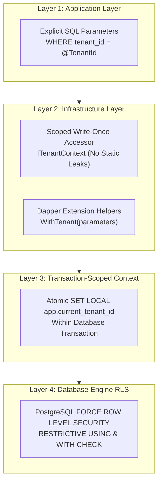
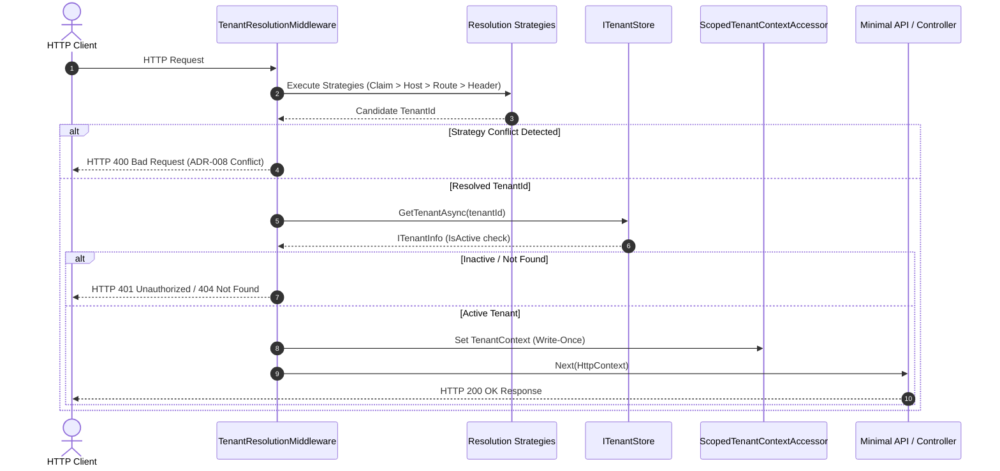

# System Architecture — EricksonLopez.MultiTenancy

> **Status:** Active  
> **Target Frameworks:** `net8.0`, `net9.0` | Analyzers: `netstandard2.0`  
> **Compilation Model:** Native AOT & Trimming Compatible

---

## 1. System Overview

`EricksonLopez.MultiTenancy` is a foundational C# library ecosystem designed to establish, propagate, and enforce tenant boundaries in multi-tenant .NET applications.

It provides a secure, explicit, and verifiable execution chain from HTTP identity resolution down to database-level isolation via relational session contexts and Row Level Security (RLS).

### Architectural Boundaries
- **What it OWNS:** Tenant identity primitives (`TenantId`), resolution pipelines, scoped context accessors, background scope factories, parameter enrichment, and database session context helpers.
- **What it DELEGATES:** User authentication (ASP.NET Core Identity / OpenID Connect), authorization & roles (ASP.NET Core Authorization), tenant provisioning/migrations (Application CI/CD), and messaging outbox (Application Event Bus).
- **What it REJECTS:** Implicit runtime SQL query rewriting, Entity Framework reflection filters, and ambient static `AsyncLocal` states.

---

## 2. 4-Layer Defense-in-Depth Model

To prevent single-point isolation failures, `EricksonLopez.MultiTenancy` organizes tenant enforcement into four complementary layers:

---

## 3. Package Dependency Graph

```mermaid
graph TD
    Abstractions["EricksonLopez.MultiTenancy.Abstractions\n(L0: Pure Contracts & TenantId)"]
    
    Core["EricksonLopez.MultiTenancy\n(L1: Engine & Stores)"]
    Analyzers["EricksonLopez.MultiTenancy.Analyzers\n(L2: Roslyn Rules)"]
    AspNetCore["EricksonLopez.MultiTenancy.AspNetCore\n(L3: Middleware & Strategies)"]
    Authentication["EricksonLopez.MultiTenancy.Authentication\n(L3: Schemes & Cookies)"]
    Configuration["EricksonLopez.MultiTenancy.Configuration\n(L3: IConfiguration Store)"]
    Dapper["EricksonLopez.MultiTenancy.Dapper\n(L4: Parameters)"]
    OpenTelemetry["EricksonLopez.MultiTenancy.OpenTelemetry\n(L6: Tracing & Metrics)"]
    Testing["EricksonLopez.MultiTenancy.Testing\n(L7: Test Harness)"]
    
    PostgreSql["EricksonLopez.MultiTenancy.PostgreSql\n(L5: PostgreSQL RLS)"]
    SqlServer["EricksonLopez.MultiTenancy.SqlServer\n(L5: SESSION_CONTEXT)"]
    MySql["EricksonLopez.MultiTenancy.MySql\n(L5: MySQL Session)"]
    MariaDb["EricksonLopez.MultiTenancy.MariaDb\n(L5: MariaDB Session)"]
    Oracle["EricksonLopez.MultiTenancy.Oracle\n(L5: Oracle VPD)"]
    Sqlite["EricksonLopez.MultiTenancy.Sqlite\n(L5: DB-Per-Tenant)"]

    Core --> Abstractions
    Analyzers --> Abstractions
    AspNetCore --> Abstractions
    Authentication --> AspNetCore
    Configuration --> Core
    Configuration --> Abstractions
    Dapper --> Abstractions
    OpenTelemetry --> Abstractions
    Testing --> Core
    Testing --> Abstractions

    PostgreSql --> Abstractions
    PostgreSql --> Dapper
    SqlServer --> Abstractions
    SqlServer --> Dapper
    MySql --> Abstractions
    MySql --> Dapper
    MariaDb --> Abstractions
    MariaDb --> Dapper
    Oracle --> Abstractions
    Oracle --> Dapper
    Sqlite --> Abstractions
    Sqlite --> Dapper
```

---

## 4. Request Resolution Lifecycle

Every incoming HTTP request traverses an orchestrated resolution pipeline:

---

## 5. Dependency Injection Lifetimes

| Service | Lifetime | Reason |
| :--- | :---: | :--- |
| `ITenantContextAccessor` | **Scoped** | Bound to the request or background scope. Prevents thread-bleed across recycled thread-pools. |
| `ITenantContext` | **Scoped** | Resolved dynamically from `ITenantContextAccessor.TenantContext`. |
| `ITenantScopeFactory` | **Singleton** | Stateless factory used to create isolated DI scopes. |
| `InMemoryTenantStore` | **Singleton** | Shared, thread-safe memory registry (`ConcurrentDictionary`). |
| `CachedTenantStore` | **Scoped / Singleton** | Decorator caching tenant metadata with thread-safe `IMemoryCache`. |
| Resolution Strategies | **Transient** | Stateless evaluation per request. |

---

## 6. Precedence & Conflict Detection (ADR-003 & ADR-008)

To eliminate **tenant spoofing attacks**:

1. **Precedence Hierarchy:**
   - **Priority 1:** Authenticated JWT Claims (`tenant_id`, `tid`, `tenant`).
   - **Priority 2:** Hostname / Subdomain (`{tenant}.app.com`).
   - **Priority 3:** Route Parameter (`/api/{tenantId}/invoices`).
   - **Priority 4:** Base Path Prefix (`/tenants/{tenantId}/...`).
   - **Priority 5 (Opt-In):** HTTP Header (`X-Tenant-ID`).
2. **Conflict Invariant:** If multiple strategies resolve different tenant IDs during the same request, the system fails closed immediately with `InvalidOperationException` (see [ADR-008](adr/adr-008-adopt-fail-closed-tenant-resolution-conflict-detection.md)). Conflicts are logged as security events.

---

## 7. Connection Pool & Transaction Safety (ADR-009)

In connection-pooled .NET applications, setting session-level state (`SET app.current_tenant_id = '...'`) causes tenant context to persist across recycled physical connections, leading to severe data leaks.

`EricksonLopez.MultiTenancy` enforces **transaction-scoped isolation**:
- **PostgreSQL:** Uses `SET LOCAL app.current_tenant_id = :tenantId` inside an explicit transaction. When the transaction commits or rolls back, PostgreSQL automatically clears the variable before returning the connection to the pool.
- **SQL Server:** Uses `sp_set_session_context 'tenant_id', @TenantId` and resets upon transaction completion.

---

## 8. Rejected Architecture Patterns

| Pattern | Status | Decision & Rationale |
| :--- | :---: | :--- |
| **Entity Framework Core Reflection Package** | **REJECTED** | [ADR-001](adr/adr-001-remove-entityframeworkcore-package.md): Blocks Native AOT, relies on reflection, and encourages insecure application-only query filters. |
| **Static AsyncLocal Accessor** | **REJECTED** | [ADR-002](adr/adr-002-redesign-async-local-accessor.md): Static fields leak ambient state across thread pool reuse. Replaced with `ScopedTenantContextAccessor`. |
| **Header-First Override** | **REJECTED** | [ADR-003](adr/adr-003-reject-header-first-resolution.md): Vulnerable to spoofing. JWT claims must strictly take precedence. |
| **Null TenantId Platform Bypass** | **REJECTED** | [ADR-004](adr/adr-004-reject-null-tenantid-bypass.md): Empty/null IDs must never bypass security filters. Platform operations require explicit administrative contexts. |
| **Automatic Global Query Filters** | **REJECTED** | [ADR-005](adr/adr-005-reject-automatic-global-tenant-filters.md): Creates a false sense of security while leaving database tier unprotected. |
| **Implicit SQL String Rewriting** | **REJECTED** | [ADR-007](adr/adr-007-reject-implicit-tenant-sql-rewriting.md): Dynamic regex/AST rewriting in hot paths is fragile and creates severe allocation overhead. |
| **Session-Level `SET` for RLS** | **REJECTED** | [ADR-009](adr/adr-009-reject-set-session-rls.md): Leaks tenant context across connection pool recycling. Only `SET LOCAL` within transactions is permitted. |

---

## 9. Package Layering & Allowed Dependencies

Each layer enforces strict dependency rules to prevent cross-layer contamination:

| Layer | Package(s) | Primary Responsibilities | Allowed Dependencies | Forbidden Dependencies |
| :--- | :--- | :--- | :--- | :--- |
| **L0: Contracts** | `EricksonLopez.MultiTenancy.Abstractions` | `TenantId`, `ITenantInfo`, `ITenantContext`, `ITenantResolver`, `ITenantScope`, `ITenantStore`, `TenantErrors` | .NET BCL, `EricksonLopez.Result` | Database SDKs, ASP.NET Core Http |
| **L1: Core Engine** | `EricksonLopez.MultiTenancy` | `ScopedTenantContextAccessor`, `DefaultTenantScopeFactory`, `InMemoryTenantStore`, `CachedTenantStore`, `HttpRemoteTenantStore`, health checks | `Abstractions`, `Microsoft.Extensions.*` | Database drivers, Web hosting |
| **L2: Analyzers** | `EricksonLopez.MultiTenancy.Analyzers` | Roslyn analyzers `ELMT001`, `ELMT002`, `ELMT003` for lifecycle safety | Roslyn SDK (`netstandard2.0`) | Runtime dependencies |
| **L3: Web Hosting** | `EricksonLopez.MultiTenancy.AspNetCore`, `Authentication` | Middleware, strategies (claims, host, route, header, basepath), endpoint filters, per-tenant options/auth | `Abstractions`, `Microsoft.AspNetCore.*` | Direct database drivers |
| **L4: Data Integration** | `EricksonLopez.MultiTenancy.Dapper` | Parameter helpers (`WithTenant`, `CreateTenantParameters`) | `Abstractions`, `Dapper` | Concrete DB drivers |
| **L5: DB Dialects** | `PostgreSql`, `SqlServer`, `MySql`, `MariaDb`, `Oracle`, `Sqlite` | Dialect-specific session variables, `SET LOCAL`, RLS policies, connection factories | `Abstractions`, `Dapper`, Concrete DB SDK | ASP.NET Core Http |
| **L6: Telemetry** | `EricksonLopez.MultiTenancy.OpenTelemetry` | Distributed tracing (`TenantActivitySource`), metrics (`TenantMetrics`), W3C Baggage | `Abstractions`, `OpenTelemetry.Api` | Database drivers |
| **L7: Testing** | `EricksonLopez.MultiTenancy.Testing` | Fakes (`FakeTenantStore`, `FakeTenantResolutionStrategy`), `TenantContextBuilder`, `FakeDbInfrastructure` | `Abstractions`, `Core` | None (Test harness only) |

Architecture boundary enforcement is verified at build time by `EricksonLopez.MultiTenancy.ArchitectureTests` using ArchUnitNET and NetArchTest.Rules.
