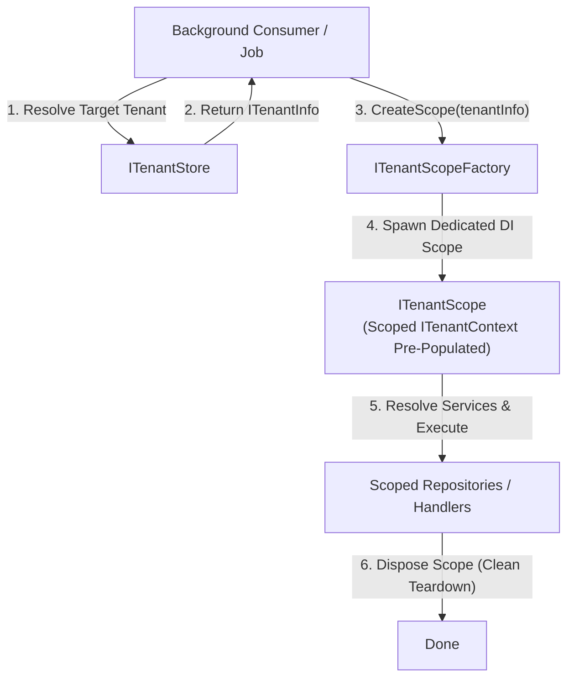

# Background Processing & Job Scoping — EricksonLopez.MultiTenancy

> **Status:** Active  
> **Target Frameworks:** `net8.0`, `net9.0`

---

## 1. The Challenge of Non-HTTP Contexts

In modern SaaS applications, significant workloads execute outside the lifecycle of an HTTP request:
- Background workers and hosted services (`IHostedService`, `BackgroundService`).
- Message queue consumers (RabbitMQ, Azure Service Bus, Kafka).
- Scheduled cron tasks (Hangfire, Quartz.NET).

Because there is no HTTP header or incoming JWT to inspect, relying on HTTP-bound resolution middleware is impossible. Furthermore, sharing a single ambient `AsyncLocal` context across multiple tenants during batch processing causes **cross-tenant data contamination**.

---

## 2. The `ITenantScopeFactory` Solution

`EricksonLopez.MultiTenancy` provides the `ITenantScopeFactory` pattern to create explicit, strongly-isolated Dependency Injection (DI) scopes for background operations.



---

## 3. Implementation Patterns

### Pattern A: Message Consumer (Single Tenant)

```csharp
using EricksonLopez.MultiTenancy;
using Microsoft.Extensions.DependencyInjection;

public class OrderSubmittedConsumer
{
    private readonly ITenantStore _tenantStore;
    private readonly ITenantScopeFactory _scopeFactory;

    public OrderSubmittedConsumer(ITenantStore tenantStore, ITenantScopeFactory scopeFactory)
    {
        _tenantStore = tenantStore;
        _scopeFactory = scopeFactory;
    }

    public async Task ConsumeAsync(OrderSubmittedMessage message, CancellationToken ct)
    {
        // 1. Resolve tenant metadata from message header
        var tenantInfo = await _tenantStore.GetTenantAsync(message.TenantId, ct);
        if (tenantInfo is null || !tenantInfo.IsActive)
        {
            throw new InvalidOperationException($"Tenant {message.TenantId} is not active or does not exist.");
        }

        // 2. Create an isolated tenant scope
        await using var scope = _scopeFactory.CreateScope(tenantInfo);

        // 3. Resolve scoped dependencies within the tenant context
        var orderService = scope.ServiceProvider.GetRequiredService<IOrderProcessingService>();
        await orderService.ProcessOrderAsync(message.OrderId, ct);
    }
}
```

---

### Pattern B: Batch Background Processing (Multi-Tenant Loop)

> [!IMPORTANT]
> **Batch Isolation Invariant:** When iterating over multiple tenants in a scheduled job, you **MUST** create and dispose a separate `ITenantScope` for every single tenant. Never reuse the same DI scope across different tenants.

```csharp
using EricksonLopez.MultiTenancy;
using Microsoft.Extensions.Hosting;
using Microsoft.Extensions.Logging;
using Microsoft.Extensions.DependencyInjection;

public class DailyInvoiceGenerationService : BackgroundService
{
    private readonly ITenantStore _tenantStore;
    private readonly ITenantScopeFactory _scopeFactory;
    private readonly ILogger<DailyInvoiceGenerationService> _logger;

    public DailyInvoiceGenerationService(
        ITenantStore tenantStore,
        ITenantScopeFactory scopeFactory,
        ILogger<DailyInvoiceGenerationService> logger)
    {
        _tenantStore = tenantStore;
        _scopeFactory = scopeFactory;
        _logger = logger;
    }

    protected override async Task ExecuteAsync(CancellationToken stoppingToken)
    {
        while (!stoppingToken.IsCancellationRequested)
        {
            var activeTenants = await GetActiveTenantIdsAsync(stoppingToken);

            foreach (var tenantId in activeTenants)
            {
                var tenantInfo = await _tenantStore.GetTenantAsync(tenantId, stoppingToken);
                if (tenantInfo is null) continue;

                // Explicit scope per tenant guarantees zero context leakage
                await using var scope = _scopeFactory.CreateScope(tenantInfo);

                try
                {
                    var billingProcessor = scope.ServiceProvider.GetRequiredService<IBillingProcessor>();
                    await billingProcessor.GeneratePendingInvoicesAsync(stoppingToken);
                }
                catch (Exception ex)
                {
                    _logger.LogError(ex, "Failed to process invoices for tenant {TenantId}", tenantId);
                }
            }

            // Wait until next billing cycle
            await Task.Delay(TimeSpan.FromHours(24), stoppingToken);
        }
    }

    private Task<IEnumerable<TenantId>> GetActiveTenantIdsAsync(CancellationToken ct)
    {
        // Load active tenant IDs from store
        return Task.FromResult<IEnumerable<TenantId>>(new[]
        {
            TenantId.Create("11111111-1111-1111-1111-111111111111"),
            TenantId.Create("22222222-2222-2222-2222-222222222222")
        });
    }
}
```

---

## 4. Key Invariants

1. **Audit Source Tagging:** Contexts created via `ITenantScopeFactory` automatically set `ITenantContext.Source = TenantResolutionSource.BackgroundJob`.
2. **Immutable Binding:** The tenant context inside an `ITenantScope` cannot be mutated or reassigned.
3. **Deterministic Cleanup:** Disposing the `ITenantScope` (via `await using`) resets the scoped accessor and disposes all scoped database connections.
