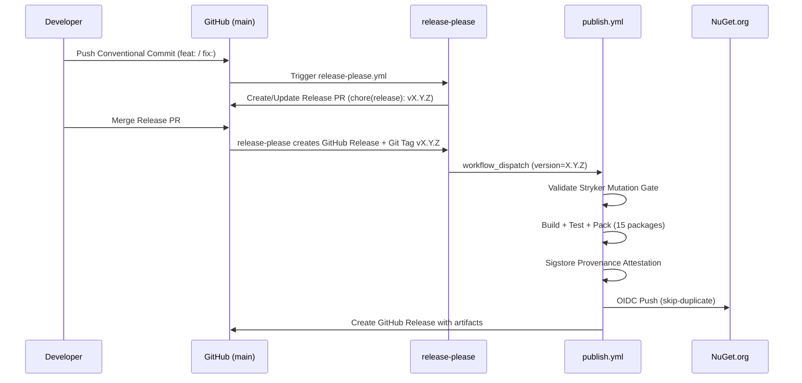

# CI/CD Pipelines & Quality Gates — EricksonLopez.MultiTenancy

This document provides a comprehensive technical overview of the automated continuous integration, continuous delivery (CI/CD), quality gates, and supply chain security architecture for `EricksonLopez.MultiTenancy`.

---

## 1. CI/CD Architecture Flow

```mermaid
flowchart TD
    subgraph CI["1. Continuous Integration (ci.yml / dotnet-build-test.yml)"]
        TriggerCI["Push / PR to main, develop"] --> Restore["dotnet restore (.slnx)"]
        Restore --> Build["dotnet build --configuration Release"]
        Build --> Test["dotnet test --collect:XPlat Code Coverage"]
        Test --> Sonar["SonarCloud Static Analysis"]
        Test --> Codecov["Codecov Coverage Upload (100% Target)"]
        Build --> ArchTests["ArchUnitNET & NetArchTest Verification"]
        Build --> RoslynTests["Roslyn Analyzer Verification"]
    end

    subgraph Mutation["2. Weekly & Dispatch Mutation Testing (mutation-testing.yml)"]
        TriggerMut["Schedule (Mon 04:00 UTC) / workflow_dispatch"] --> StrykerMatrix["Stryker.NET Matrix (15 Packages)"]
        StrykerMatrix --> EvalGate["scripts/verify-mutation-gate.js"]
        EvalGate --> StatusCheck["GitHub Commit Status: mutation-testing/stryker (≥95% Threshold)"]
    end

    subgraph Release["3. Release Automation & Publishing (release-please.yml / publish.yml)"]
        MergePR["Merge Release PR to main"] --> ReleasePlease["release-please-action"]
        ReleasePlease --> CreateTag["Create Git Tag vX.Y.Z & GitHub Release"]
        CreateTag --> TriggerPublish["Trigger publish.yml"]
        TriggerPublish --> ValidateGate["Validate Stryker Quality Gate Status"]
        ValidateGate --> Pack["dotnet pack (15 Packages)"]
        Pack --> Sigstore["actions/attest-build-provenance (SLSA Attestation)"]
        Sigstore --> NuGetOIDC["NuGet/login@v1 (OIDC Authentication)"]
        NuGetOIDC --> PushNuGet["dotnet nuget push to NuGet.org"]
    end
```

---

## 2. GitHub Actions Workflows

### 1. `ci.yml` & `dotnet-build-test.yml` (Reusable)
- **Triggers:** Push and Pull Request targeting `main` or `develop`.
- **Primary Steps:**
  1. Sets up .NET SDK `10.0.x`.
  2. Restores Strong Name Key from secret `SNK_KEY` to `EricksonLopez.MultiTenancy.snk`.
  3. Sets up Java 17 and executes SonarCloud scanner (`ericksonlopezf_dotnet-multitenancy`).
  4. Builds the solution in `Release` configuration with `<TreatWarningsAsErrors>true</TreatWarningsAsErrors>`.
  5. Executes all unit, integration, and architecture tests with XPlat Code Coverage (`opencover`, `cobertura`).
  6. Uploads test TRX results and publishes coverage reports to Codecov.

#### Reusable Workflow Contract (`dotnet-build-test.yml`)

| Input | Type | Default | Required | Description |
| :--- | :---: | :---: | :---: | :--- |
| `dotnet-version` | `string` | `"10.0.x"` | No | .NET SDK version to install |
| `test-filter` | `string` | `""` | No | MSTest/xUnit filter expression (e.g., `Category!=Integration`) |
| `test-project` | `string` | `""` | No | Path to a specific test project. Empty = run entire solution |
| `upload-coverage` | `boolean` | `true` | No | Whether to upload coverage artifacts to Codecov |
| `artifact-name` | `string` | `"test-results"` | No | Name of the uploaded test results artifact |

| Secret | Required | Description |
| :--- | :---: | :--- |
| `SNK_KEY` | No | Base64-encoded Strong Name Key (`.snk`) |
| `CODECOV_TOKEN` | No | Codecov upload token |
| `SONAR_TOKEN` | No | SonarCloud analysis token |

**Artifacts Produced:** `{artifact-name}` — directory containing `.trx` test result files and `coverage.opencover.xml` / `coverage.cobertura.xml`.

**Workflow Dependencies:** Called by `ci.yml` and `publish.yml` via `uses:` reference.

### 2. `mutation-testing.yml`
- **Triggers:** Weekly cron schedule (`0 4 * * 1`) and manual `workflow_dispatch`.
- **Matrix Strategy:** Executes Stryker.NET across all 15 production packages in parallel.
- **Threshold Policy:**
  - **High:** $\ge 100\%$ (:white_check_mark: High)
  - **Low:** $\ge 98\%$ (:yellow_circle: Low)
  - **Warn:** $\ge 95\%$ (:orange_circle: Warning)
  - **Break:** $< 95\%$ (:x: Failed - Stryker exits non-zero)
- **Consolidated Gate:** Evaluates consolidated score across all 15 JSON summaries and posts a GitHub commit status (`mutation-testing/stryker`).

### 3. `release-please.yml`
- **Triggers:** Push to `main`.
- **Action:** Runs `googleapis/release-please-action@v4` using `.release-please-config.json` and `.release-please-manifest.json`.
- **Function:** Parses Conventional Commits (`feat:`, `fix:`, `perf:`), bumps version in `Directory.Build.props`, generates release notes, and triggers `publish.yml` upon merge.

### 4. `publish.yml`
- **Triggers:** Git tags `v*.*.*` and automated dispatch from `release-please.yml`.
- **Execution Flow:**
  1. Resolves semantic version from release trigger or `Directory.Build.props`.
  2. Executes `scripts/verify-mutation-gate.js` to ensure the Stryker mutation gate passed.
  3. Restores SNK key and builds Release packages.
  4. Runs complete test suite before packing.
  5. Packs all 15 NuGet packages into `./nupkgs`.
  6. Generates SLSA-compliant Sigstore Provenance Attestations (`actions/attest-build-provenance@v2`).
  7. Authenticates with NuGet.org using passwordless OIDC (`NuGet/login@v1`).
  8. Pushes packages to NuGet.org with `--skip-duplicate`.
  9. Creates the official GitHub Release with release artifacts and package tables.

---

## 3. Required Secrets

| Secret Name | Description | Used In Workflow |
| :--- | :--- | :--- |
| `SNK_KEY` | Base64-encoded Strong Name Key (`.snk`) for assembly signing | `dotnet-build-test.yml`, `publish.yml` |
| `CODECOV_TOKEN` | Token for uploading coverage reports to Codecov | `dotnet-build-test.yml`, `publish.yml` |
| `SONAR_TOKEN` | Token for SonarCloud code analysis | `dotnet-build-test.yml` |
| `GITHUB_TOKEN` | Default GitHub Actions token for status checks and releases | All workflows |
| OIDC Trust | Federated OpenID Connect role for `ericksonlopezf` on NuGet.org | `publish.yml` |

---

## 4. Quality Gates Summary

1. **Compiler Warnings:** Zero warnings allowed (`<TreatWarningsAsErrors>true</TreatWarningsAsErrors>`).
2. **Code Coverage:** 100% line, branch, and method coverage verified by Coverlet and Codecov.
3. **Mutation Testing:** Consolidated mutation score must be ≥ 95% to allow package publication.
4. **Architecture Tests:** Enforced by ArchUnitNET and NetArchTest to prevent cross-layer dependency contamination.
5. **Roslyn Analyzers:** `ELMT001`, `ELMT002`, `ELMT003` active in every build.
6. **Supply Chain Security:** Strong Name Key signing, Sigstore SLSA provenance attestation, and NuGet OIDC publishing.

> For the detailed per-package quality tracking matrix and test suite descriptions, see [testing-strategy.md](testing-strategy.md).

---

## 5. Branch Strategy

Branch patterns are derived from CI trigger configuration in `ci.yml`:

| Branch | Purpose |
| :--- | :--- |
| `main` | Production-ready release branch. All releases are tagged and published from here. |
| `develop` | Integration branch for ongoing development. CI runs on push and PRs targeting this branch. |
| `feat/*` | Short-lived feature branches. Merged to `develop` via Pull Request. |
| `fix/*` | Bug fix branches. Merged to `develop` via Pull Request. |
| `docs/*` | Documentation-only changes. |
| `refactor/*` | Refactoring without behavior changes. |

Pull Requests targeting `main` or `develop` trigger the full `dotnet-build-test.yml` pipeline (restore → build → test → coverage → SonarCloud).

---

## 6. Release Strategy

### Versioning

- **Scheme:** [Semantic Versioning](https://semver.org/) (`MAJOR.MINOR.PATCH`).
- **Version Source:** `VersionPrefix` in `Directory.Build.props` — updated automatically by `release-please`.
- **Pre-release Detection:** `publish.yml` sets `prerelease: true` if the version string contains a `-` (e.g. `1.1.0-beta.1`).

### Release Automation Flow

### Package Version Resolution Priority

The `publish.yml` resolves the version from three sources, in priority order:

1. `workflow_dispatch` input `version` (set by `release-please` automatically)
2. Git tag ref (`refs/tags/v*.*.*`) — legacy manual tag push
3. `VersionPrefix` from `Directory.Build.props` — fallback

---

## 7. Supply Chain Security

| Mechanism | Description | Status |
| :--- | :--- | :---: |
| **Sigstore SLSA Attestation** | `actions/attest-build-provenance@v2` generates SLSA-compliant build provenance for all `.nupkg` artifacts | ✅ Active |
| **NuGet Trusted Publishing (OIDC)** | `NuGet/login@v1` authenticates with NuGet.org via GitHub OIDC federation — no static API keys stored | ✅ Active |
| **Strong Name Signing** | Assemblies are signed using an `.snk` key stored as `SNK_KEY` secret, decoded at runtime | ✅ Active |
| **Central Package Management (CPM)** | All NuGet dependency versions centrally locked in `Directory.Packages.props` | ✅ Active |
| **SourceLink** | `PublishRepositoryUrl=true`, `EmbedUntrackedSources=true`, `.snupkg` symbol packages | ✅ Active |
| **Deterministic Builds** | Enabled via MSBuild properties for verifiable package reproduction | ✅ Active |

