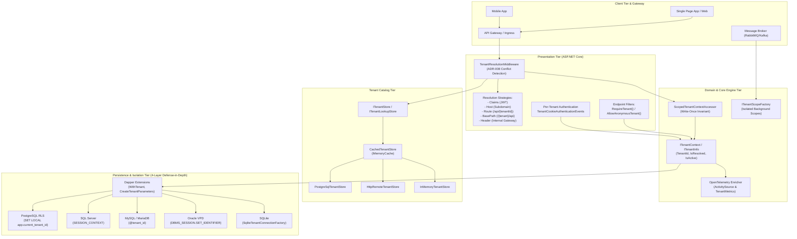
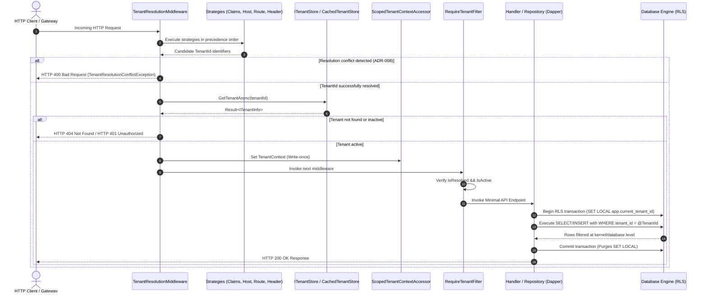
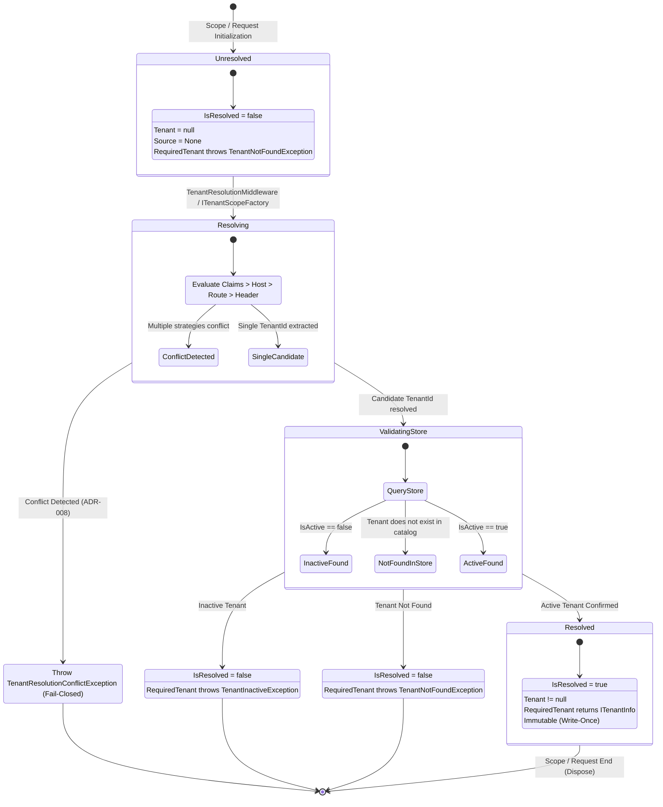
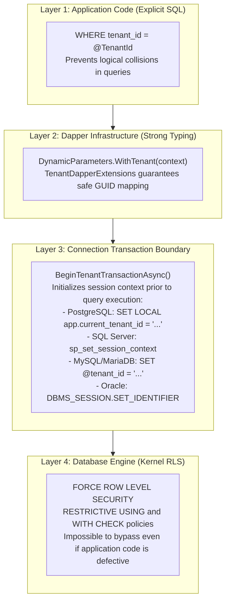
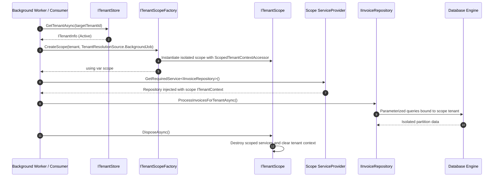
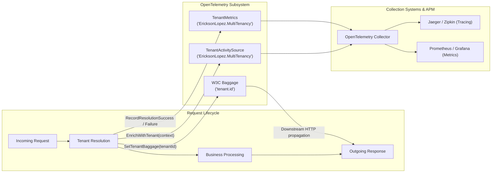

# Architecture and Flow Diagrams — EricksonLopez.MultiTenancy

This document provides visual diagrams in Mermaid syntax illustrating the overall architecture, package dependencies, context lifecycle, HTTP pipeline, background processing, error handling, and database-level isolation of `EricksonLopez.MultiTenancy`.

---

## 1. General System Architecture

---

## 2. Primary System Flow (HTTP Request-Response)

---

## 3. Context State Machine (`ITenantContext`)

---

## 4. Database Isolation Pipeline (4-Layer Defense-in-Depth)

---

## 5. Background Processing (`ITenantScopeFactory`)

---

## 6. Observability and OpenTelemetry Telemetry Pipeline

---

## 7. Component Dependency Hierarchy

```mermaid
graph TD
    Abstractions["EricksonLopez.MultiTenancy.Abstractions\n(L0: Primitives, TenantId, Contracts)"]
    
    Core["EricksonLopez.MultiTenancy\n(L1: Scopes, In-Memory/HTTP/Cached Stores, HealthChecks)"]
    Analyzers["EricksonLopez.MultiTenancy.Analyzers\n(L2: Roslyn Code Fixes & Diagnostics)"]
    AspNetCore["EricksonLopez.MultiTenancy.AspNetCore\n(L3: Middleware, HTTP Strategies, Routing)"]
    Authentication["EricksonLopez.MultiTenancy.Authentication\n(L3: Per-Tenant Auth Schemes)"]
    Configuration["EricksonLopez.MultiTenancy.Configuration\n(L3: Store for appsettings.json)"]
    Dapper["EricksonLopez.MultiTenancy.Dapper\n(L4: DynamicParameters Extensions)"]
    OpenTelemetry["EricksonLopez.MultiTenancy.OpenTelemetry\n(L6: ActivitySource, Metrics, Baggage)"]
    Testing["EricksonLopez.MultiTenancy.Testing\n(L7: Fakes, Test Doubles, Harness)"]
    
    PostgreSql["EricksonLopez.MultiTenancy.PostgreSql\n(L5: RLS SET LOCAL)"]
    SqlServer["EricksonLopez.MultiTenancy.SqlServer\n(L5: SESSION_CONTEXT)"]
    MySql["EricksonLopez.MultiTenancy.MySql\n(L5: Session Variables)"]
    MariaDb["EricksonLopez.MultiTenancy.MariaDb\n(L5: Session Variables)"]
    Oracle["EricksonLopez.MultiTenancy.Oracle\n(L5: DBMS_SESSION VPD)"]
    Sqlite["EricksonLopez.MultiTenancy.Sqlite\n(L5: Connection Factory)"]

    Core --> Abstractions
    Analyzers --> Abstractions
    AspNetCore --> Abstractions
    Authentication --> AspNetCore
    Configuration --> Core
    Configuration --> Abstractions
    Dapper --> Abstractions
    OpenTelemetry --> Abstractions
    Testing --> Core
    Testing --> Abstractions

    PostgreSql --> Abstractions
    PostgreSql --> Dapper
    SqlServer --> Abstractions
    SqlServer --> Dapper
    MySql --> Abstractions
    MySql --> Dapper
    MariaDb --> Abstractions
    MariaDb --> Dapper
    Oracle --> Abstractions
    Oracle --> Dapper
    Sqlite --> Abstractions
    Sqlite --> Dapper
```

