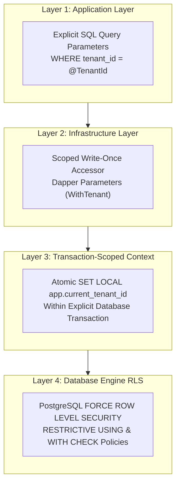
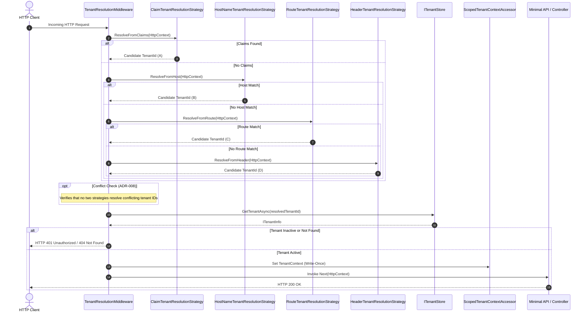
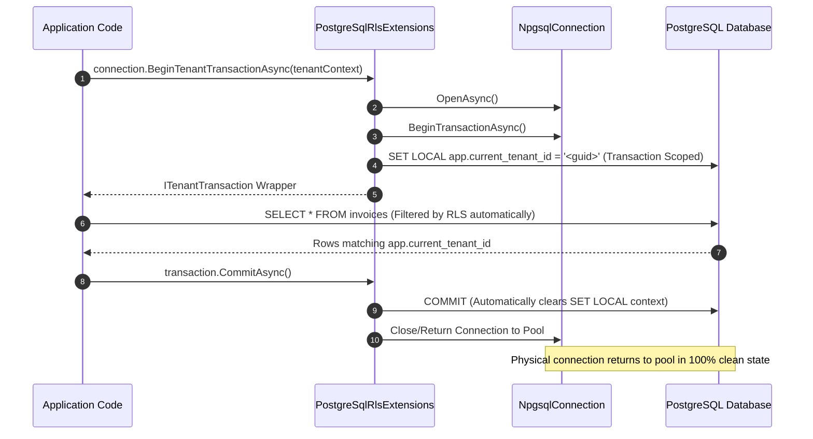
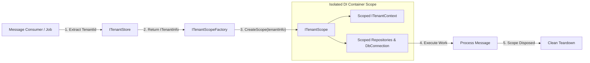

# Architectural & Visual Diagrams — EricksonLopez.MultiTenancy

This document provides visual diagrams illustrating the structural relationships, request lifecycles, database security mechanics, and isolation boundaries of `EricksonLopez.MultiTenancy`.

---

## 1. 4-Layer Defense-in-Depth Model

---

## 2. HTTP Request Resolution Pipeline

---

## 3. PostgreSQL RLS Transaction Lifecycle

---

## 4. Background Job & Message Consumer Scoping

---

## 5. Ecosystem Package Dependency Tree

```mermaid
graph TD
    Abstractions["EricksonLopez.MultiTenancy.Abstractions"]
    
    Core["EricksonLopez.MultiTenancy"]
    Analyzers["EricksonLopez.MultiTenancy.Analyzers"]
    AspNetCore["EricksonLopez.MultiTenancy.AspNetCore"]
    Authentication["EricksonLopez.MultiTenancy.Authentication"]
    Configuration["EricksonLopez.MultiTenancy.Configuration"]
    Dapper["EricksonLopez.MultiTenancy.Dapper"]
    OpenTelemetry["EricksonLopez.MultiTenancy.OpenTelemetry"]
    Testing["EricksonLopez.MultiTenancy.Testing"]
    
    PostgreSql["EricksonLopez.MultiTenancy.PostgreSql"]
    SqlServer["EricksonLopez.MultiTenancy.SqlServer"]
    MySql["EricksonLopez.MultiTenancy.MySql"]
    MariaDb["EricksonLopez.MultiTenancy.MariaDb"]
    Oracle["EricksonLopez.MultiTenancy.Oracle"]
    Sqlite["EricksonLopez.MultiTenancy.Sqlite"]

    Core --> Abstractions
    Analyzers --> Abstractions
    AspNetCore --> Abstractions
    Authentication --> AspNetCore
    Configuration --> Core
    Configuration --> Abstractions
    Dapper --> Abstractions
    OpenTelemetry --> Abstractions
    Testing --> Core

    PostgreSql --> Abstractions
    PostgreSql --> Dapper
    SqlServer --> Abstractions
    SqlServer --> Dapper
    MySql --> Abstractions
    MySql --> Dapper
    MariaDb --> Abstractions
    MariaDb --> Dapper
    Oracle --> Abstractions
    Oracle --> Dapper
    Sqlite --> Abstractions
    Sqlite --> Dapper
```

