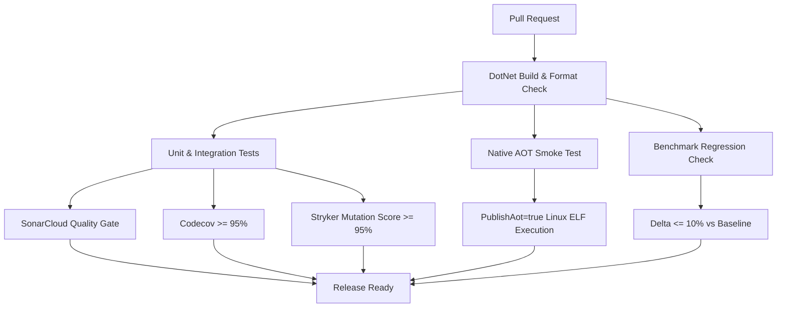
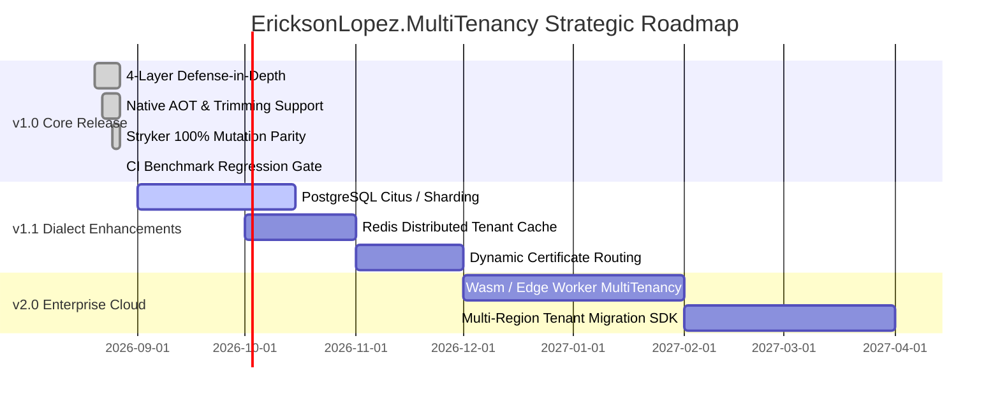

# Matrices, Quality Gates & Strategic Roadmap — EricksonLopez.MultiTenancy

> **Version**: 1.0.0  
> **Governance Standard**: Tier 0 Foundational Security Invariants  
> **Auditor**: Principal Enterprise Architect  

---

## 1. Quality Gates & Release Criteria

Every pull request and release build must satisfy 100% of the following automated quality gates:

| Quality Dimension | Tooling | Threshold / Policy | Enforcement Workflow |
|---|---|---|---|
| **Compilation & Warnings** | .NET 10 SDK / Roslyn | `TreatWarningsAsErrors=true`, 0 Warnings | `ci.yml` / `dotnet-build-test.yml` |
| **Code Formatting** | `dotnet format` | `--verify-no-changes` (Zero drift) | `dotnet-build-test.yml` |
| **Code Coverage** | Coverlet / Codecov | $\ge 95\%$ Line & Branch Coverage | `dotnet-build-test.yml` |
| **Static Analysis & Security** | SonarCloud | Quality Gate: **PASSED**, 0 Bugs, 0 Vulnerabilities, 0 Security Hotspots | `dotnet-build-test.yml` |
| **Mutation Testing** | Stryker.NET | Global Score $\ge 95\%$ (`break: 95`), Verified: **100.00%** | `mutation-testing.yml` |
| **Native AOT Compatibility** | ILC / NativeAOT | 0 Trim / AOT Warnings (`IL2026`, `IL3050`), Zero exit code | `aot-smoke-test.yml` |
| **Performance Regression** | BenchmarkDotNet | Mean Latency Regression $\le 10\%$ vs `main` baseline | `benchmark-regression-gate.yml` |
| **Repository Compliance** | PowerShell Scripts | 100% Copyright headers, valid kebab-case docs, zero [Obsolete] | `repo-compliance.yml` |

---

## 2. Capability Matrix Across Application Lifecycles

| Capability Area | ASP.NET Core Web API | Background Workers & Consumers | CLI / Console Tools |
|---|:---:|:---:|:---:|
| **Tenant Resolution** | Multi-Strategy HTTP Middleware | `ITenantScopeFactory` Explicit Scopes | `StaticTenantResolutionStrategy` |
| **Database Isolation** | Transactional `SET LOCAL` / `SESSION_CONTEXT` | Transactional `SET LOCAL` / `SESSION_CONTEXT` | Connection Routing / Parameter Binding |
| **Configuration Options** | Scoped `ITenantOptions<T>` | Scoped `ITenantOptions<T>` | Direct In-Memory Provider |
| **Distributed Tracing** | OpenTelemetry Activity Middleware | OpenTelemetry Message Baggage Consumer | Standalone Trace Activity Source |
| **Health Checking** | `/health/tenants` Endpoint Check | Scheduled Health Probe | Standalone Database Probe |

---

## 3. Strategic Engineering Roadmap

