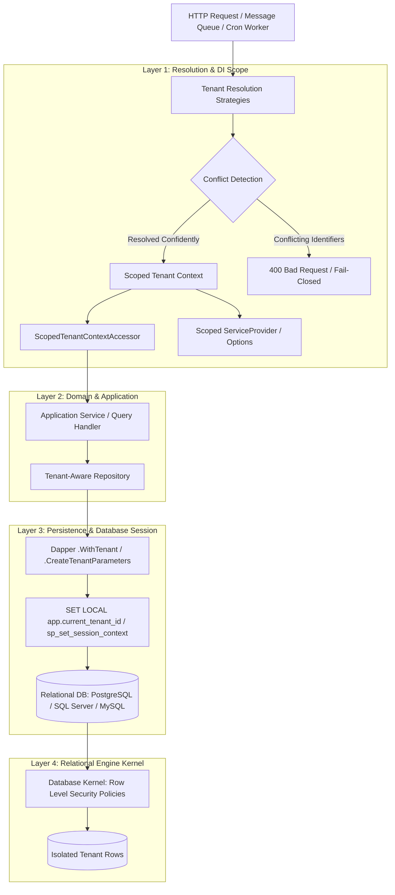

# System Overview & Architectural Topology — EricksonLopez.MultiTenancy

> **Design Pattern**: Clean Architecture / Domain-Driven Design / 4-Layer Defense-in-Depth  
> **Platform**: Cross-platform .NET 8 / 9 / 10  
> **Execution Profile**: Native AOT, Reflection-Free, Zero-Allocation hot paths  

---

## 1. High-Level Architectural Topology

The following diagram illustrates how an incoming multi-tenant request flows through the entire system:

---

## 2. Component Interaction & Flow

### Phase A: Request Ingress & Resolution
1. An incoming request enters `TenantResolutionMiddleware`.
2. Multiple configured strategies (Claims, Header, Route, BasePath, HostName) attempt to resolve the tenant identifier.
3. If multiple strategies resolve different non-empty tenant identifiers, the request is aborted immediately with a `400 Bad Request` or `TenantErrors.StrategyFailed` (fail-closed conflict detection, ADR-008).

### Phase B: Scoped Context Binding
1. The resolved `TenantInfo` is retrieved from `ITenantStore`.
2. `ScopedTenantContextAccessor` binds the `ITenantContext` into the request's `IServiceScope`.
3. Roslyn Analyzers `ELMT001` and `ELMT002` ensure that no static fields or singleton services capture this scoped instance.

### Phase C: Data Access & Session Setup
1. The repository creates a database transaction.
2. The database dialect extension (`SetTenantRlsContextAsync` for PostgreSQL or `SetTenantSessionContextAsync` for SQL Server) executes the transaction-scoped session variable command.
3. Dapper queries bind explicit `@TenantId` parameters (verified by Roslyn Analyzer `ELMT003`).

### Phase D: Relational Database Execution
1. The database kernel enforces Row Level Security policies (`USING (tenant_id = current_setting('app.current_tenant_id', true)::uuid)`).
2. Rows belonging to any other tenant are physically inaccessible and invisible to the query execution plan.
3. When the transaction commits, PostgreSQL automatically discards the session variable, returning a clean connection to the pool (ADR-009).
